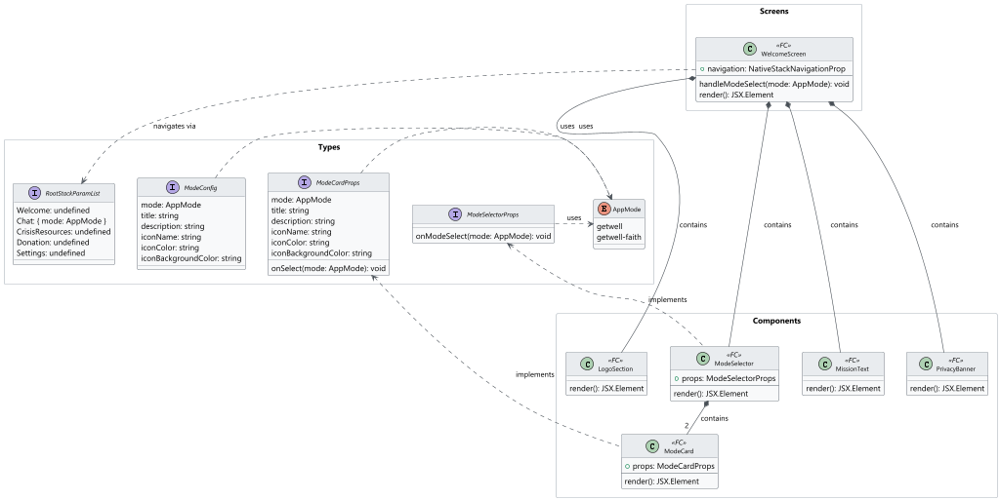
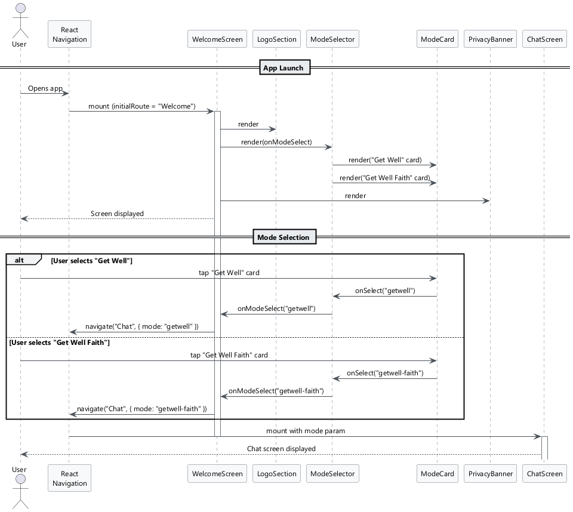
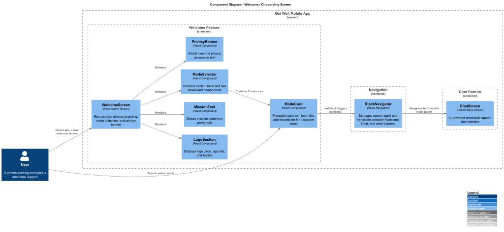

# Detailed Design: Welcome / Onboarding Screen

## 1. Overview

### 1.1 Purpose

The Welcome / Onboarding Screen is the first screen users see when launching the Get Well app. It introduces the app's mission, establishes trust through privacy assurance, and presents two equally-weighted support modes for the user to choose from.

### 1.2 Requirements Traceability

| Requirement | Description |
|-------------|-------------|
| L1-1 | Welcome screen introducing Get Well with mode selection |
| L2-1.1 | App branding, logo, tagline "Free. Anonymous. Always here." |
| L2-1.2 | Two mode cards: "Get Well" and "Get Well Faith" |
| L2-1.3 | Privacy statement: "No accounts. No data stored. Completely anonymous." |

### 1.3 User Flow

1. User opens the app for the first time (or any subsequent launch).
2. The `WelcomeScreen` renders with branding, mission text, and mode cards.
3. User reads the mission and privacy assurance.
4. User taps one of the two mode cards.
5. The app navigates to the corresponding Chat screen (`ChatGetWell` or `ChatGetWellFaith`).

### 1.4 Feature Scope

- Display app logo, name, and tagline.
- Present a brief mission statement.
- Show two mode selection cards with icons and descriptions.
- Display a privacy assurance banner.
- Navigate to the selected chat mode on tap.

---

## 2. Component Architecture



### 2.1 Component Tree

```
WelcomeScreen
├── LogoSection
│   ├── LogoCircle (icon)
│   ├── Title
│   └── Subtitle (tagline)
├── MissionText
├── ModeSelector
│   ├── SectionLabel ("Choose your path")
│   ├── ModeCard (Get Well)
│   └── ModeCard (Get Well Faith)
└── PrivacyBanner
    ├── ShieldIcon
    └── PrivacyText
```

### 2.2 WelcomeScreen

The root screen component registered with React Navigation.

| Aspect | Detail |
|--------|--------|
| **File** | `src/screens/WelcomeScreen.tsx` |
| **Type** | Functional component (React.FC) |
| **Navigation** | Registered as `"Welcome"` in the root `StackNavigator` |
| **State** | Stateless; delegates navigation on mode selection |
| **Behavior** | Renders all child components. On mode card press, calls `navigation.navigate('Chat', { mode })`. |

**Props:** Receives `navigation` and `route` from React Navigation (`NativeStackScreenProps<RootStackParamList, 'Welcome'>`).

### 2.3 LogoSection

Displays the app logo circle, title, and tagline.

| Aspect | Detail |
|--------|--------|
| **File** | `src/components/welcome/LogoSection.tsx` |
| **Props** | None (uses design tokens directly) |
| **Renders** | 80x80 circle with green background (`#C8F0D8`), heart icon (`#3D8A5A`), title "Get Well" (32px bold), subtitle "Free. Anonymous. Always here." (15px medium) |

### 2.4 MissionText

A single centered paragraph describing the app's purpose.

| Aspect | Detail |
|--------|--------|
| **File** | `src/components/welcome/MissionText.tsx` |
| **Props** | None |
| **Renders** | "24/7 emotional support for anyone, anytime. No barriers. No judgment." centered, 14px, color `#6D6C6A` |

### 2.5 ModeCard

A pressable card representing one of the two support modes.

| Aspect | Detail |
|--------|--------|
| **File** | `src/components/welcome/ModeCard.tsx` |
| **Props** | `ModeCardProps` (see Interfaces below) |
| **Behavior** | On press, invokes `onSelect` callback. Renders icon circle, title, and description. |
| **Accessibility** | `accessibilityRole="button"`, `accessibilityLabel` set to mode title + description |

### 2.6 ModeSelector

Container that renders the "Choose your path" label and a horizontal row of two `ModeCard` components.

| Aspect | Detail |
|--------|--------|
| **File** | `src/components/welcome/ModeSelector.tsx` |
| **Props** | `ModeSelectorProps` (`onModeSelect: (mode: AppMode) => void`) |
| **Renders** | Section label + horizontal `View` with gap 12 containing two `ModeCard` instances |

### 2.7 PrivacyBanner

A small row displaying the shield-check icon and privacy text.

| Aspect | Detail |
|--------|--------|
| **File** | `src/components/welcome/PrivacyBanner.tsx` |
| **Props** | None |
| **Renders** | `shield-check` icon (color `#9C9B99`) + "No accounts. No data stored. Completely anonymous." (12px, `#9C9B99`) |

---

## 3. Interfaces and Types

### 3.1 AppMode

```typescript
type AppMode = 'getwell' | 'getwell-faith';
```

### 3.2 RootStackParamList

```typescript
type RootStackParamList = {
  Welcome: undefined;
  Chat: { mode: AppMode };
  CrisisResources: undefined;
  Donation: undefined;
  Settings: undefined;
};
```

### 3.3 ModeCardProps

```typescript
interface ModeCardProps {
  mode: AppMode;
  title: string;
  description: string;
  iconName: string;            // Icon identifier (e.g., 'heart', 'cross')
  iconColor: string;           // Icon foreground color
  iconBackgroundColor: string;  // Icon circle background color
  onSelect: (mode: AppMode) => void;
}
```

### 3.4 ModeSelectorProps

```typescript
interface ModeSelectorProps {
  onModeSelect: (mode: AppMode) => void;
}
```

### 3.5 ModeConfig

Static configuration object used to populate mode cards.

```typescript
interface ModeConfig {
  mode: AppMode;
  title: string;
  description: string;
  iconName: string;
  iconColor: string;
  iconBackgroundColor: string;
}

const MODE_CONFIGS: ModeConfig[] = [
  {
    mode: 'getwell',
    title: 'Get Well',
    description: 'Warm, empathetic, judgment-free support',
    iconName: 'heart',
    iconColor: '#3D8A5A',
    iconBackgroundColor: '#C8F0D8',
  },
  {
    mode: 'getwell-faith',
    title: 'Get Well Faith',
    description: 'Christian-values-based support with prayer & scripture',
    iconName: 'cross',
    iconColor: '#D89575',
    iconBackgroundColor: '#F0DDD2',
  },
];
```

---

## 4. Styling and Design Tokens

### 4.1 Screen Layout

| Token | Value |
|-------|-------|
| Screen background | `#F5F4F1` |
| Screen corner radius | 20 |
| Content padding (horizontal) | 24 |
| Content gap (vertical) | 24 |

### 4.2 Typography (Outfit Font Family)

| Element | Size | Weight | Color |
|---------|------|--------|-------|
| Title ("Get Well") | 32px | Bold (700) | `#1A1918` |
| Subtitle (tagline) | 15px | Medium (500) | `#6D6C6A` |
| Mission text | 14px | Regular (400) | `#6D6C6A` |
| Section label ("Choose your path") | 18px | SemiBold (600) | `#1A1918` |
| Card title | 16px | SemiBold (600) | `#1A1918` |
| Card description | 12px | Regular (400) | `#6D6C6A` |
| Privacy text | 12px | Regular (400) | `#9C9B99` |

### 4.3 Colors

| Name | Hex | Usage |
|------|-----|-------|
| Background | `#F5F4F1` | Screen background |
| Text Primary | `#1A1918` | Titles, labels |
| Text Secondary | `#6D6C6A` | Descriptions, mission text |
| Text Muted | `#9C9B99` | Privacy text, shield icon |
| Green Accent | `#3D8A5A` | Get Well icon, heart |
| Green Light | `#C8F0D8` | Logo circle bg, Get Well icon circle bg |
| Coral Accent | `#D89575` | Get Well Faith icon, cross |
| Coral Light | `#F0DDD2` | Get Well Faith icon circle bg |
| Card Background | `#FFFFFF` | Mode card background |

### 4.4 Component Dimensions

| Element | Dimension |
|---------|-----------|
| Logo circle | 80 x 80, borderRadius 40 |
| Mode card icon circle | 48 x 48, borderRadius 24 |
| Mode card | borderRadius 16, shadow (elevation 2) |
| Mode card row gap | 12 |
| Shield icon size | 16 |

---

## 5. Navigation



### 5.1 Navigation Stack

The `WelcomeScreen` is the initial route in the root `StackNavigator`:

```typescript
const Stack = createNativeStackNavigator<RootStackParamList>();

<Stack.Navigator initialRouteName="Welcome">
  <Stack.Screen
    name="Welcome"
    component={WelcomeScreen}
    options={{ headerShown: false }}
  />
  <Stack.Screen name="Chat" component={ChatScreen} />
  {/* ...other screens */}
</Stack.Navigator>
```

### 5.2 Navigation Flow

1. App launches and renders `WelcomeScreen` (no header bar).
2. User taps a mode card.
3. `WelcomeScreen` calls `navigation.navigate('Chat', { mode: 'getwell' })` or `navigation.navigate('Chat', { mode: 'getwell-faith' })`.
4. The `ChatScreen` reads `route.params.mode` to configure the AI persona and visual theme.

### 5.3 Back Navigation

The `WelcomeScreen` has no back button (it is the root). From the `ChatScreen`, the user can navigate back to mode selection via the header back button or a dedicated mode-switch control.

---

## 6. System Context



The `WelcomeScreen` is a purely presentational feature within the Mobile App container. It has no backend dependencies -- it does not call the API or access any persistent storage. Its only system interaction is with the React Navigation router to transition the user into a chat session.

---

## 7. Accessibility

| Concern | Implementation |
|---------|---------------|
| Screen reader | All text elements use semantic labels. Mode cards have `accessibilityRole="button"` with descriptive labels. |
| Touch targets | Mode cards span the full available width (50% minus gap). Minimum 48dp touch target on pressable areas. |
| Color contrast | All text colors meet WCAG AA contrast ratio against `#F5F4F1` background. |
| Font scaling | Typography uses relative sizing via React Native's `allowFontScaling`. |

---

## 8. Testing Strategy

| Layer | Scope |
|-------|-------|
| Unit | `ModeCard` renders correct title, description, and icon for each mode config. `ModeCard` `onSelect` fires with correct `AppMode` value. |
| Unit | `PrivacyBanner` renders shield icon and privacy text. |
| Integration | `WelcomeScreen` renders all child components. Pressing each mode card triggers `navigation.navigate` with correct params. |
| Snapshot | `WelcomeScreen` snapshot matches expected layout. |
| E2E | App launches to Welcome screen. Tapping "Get Well" navigates to general chat. Tapping "Get Well Faith" navigates to faith chat. |

---

## 9. File Manifest

```
src/
├── screens/
│   └── WelcomeScreen.tsx
├── components/
│   └── welcome/
│       ├── LogoSection.tsx
│       ├── MissionText.tsx
│       ├── ModeCard.tsx
│       ├── ModeSelector.tsx
│       └── PrivacyBanner.tsx
├── types/
│   └── navigation.ts          # RootStackParamList, AppMode
└── constants/
    └── modeConfig.ts           # MODE_CONFIGS array
```
