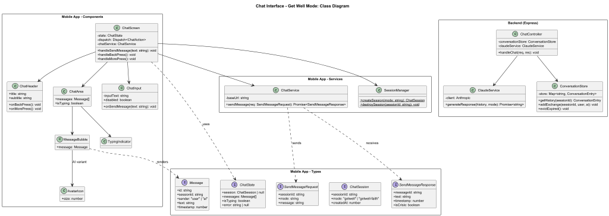
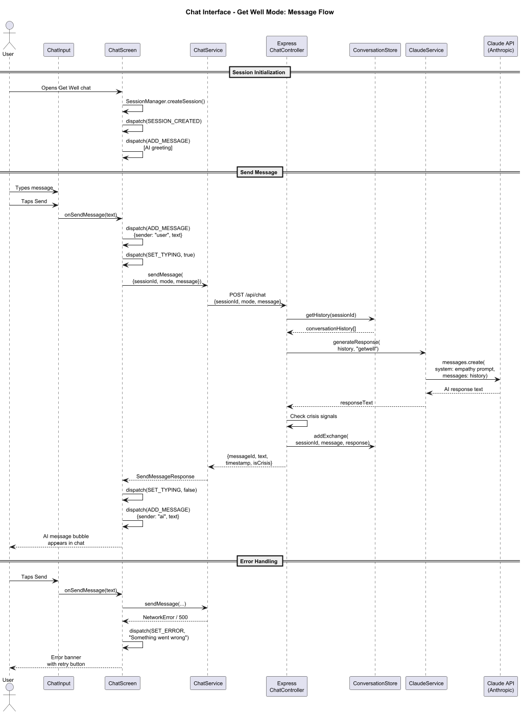
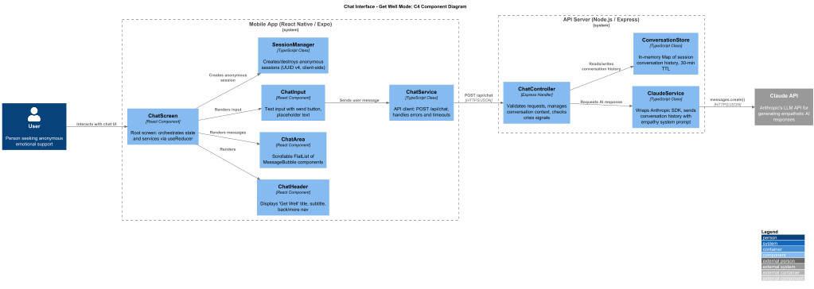

# Chat Interface - Get Well Mode: Detailed Design

## Overview

### Purpose

The Get Well Mode chat interface is the primary feature of the GetWell app, providing warm, empathetic, judgment-free AI emotional support available 24/7. This screen is reached after the user selects "Get Well" from the Welcome/Onboarding screen. It connects the user to an AI conversational partner powered by the Claude API (Anthropic), configured with a system prompt that guides empathetic, supportive responses.

### User Flow

1. User taps "Get Well" on the Welcome screen.
2. App navigates to `ChatScreen` and initializes an anonymous session.
3. An initial AI greeting message is displayed (e.g., "Hi there. I'm here for you. Whatever you're going through, you don't have to face it alone. How are you feeling today?").
4. User types a message and taps Send.
5. The message appears in the chat as a user bubble; a typing indicator appears for the AI.
6. The backend receives the message, calls Claude API, and returns the AI response.
7. The AI response appears as an AI bubble with avatar.
8. Conversation continues in this loop. All messages are held in memory for the session only.

### Anonymous Session Handling

- No user accounts, no login, no PII collection.
- A random `sessionId` (UUID v4) is generated on the client when the chat screen mounts.
- The `sessionId` is sent with each API request so the backend can maintain conversation context for the duration of the session.
- When the user leaves the chat screen or closes the app, the session is discarded. No messages are persisted.
- The backend may retain conversation context in memory (keyed by `sessionId`) with a TTL of 30 minutes for multi-turn coherence, after which it is evicted.

### Requirements Traceability

| Requirement | Description |
|---|---|
| L1-2 | Warm, empathetic, judgment-free AI chat interface for general emotional support |
| L2-2.1 | Chat bubble layout with user messages right, AI left with avatar |
| L2-2.2 | Text input with send button, placeholder "How are you feeling?" |
| L2-2.3 | Header with "Get Well" title, subtitle, back nav, more menu |

---

## Screen Layout

**Dimensions:** 402 x 874 (logical points)

**Background:** `#F5F4F1` (warm cream)

The screen is divided into three vertical sections:

1. **ChatHeader** - Fixed top
2. **Green Accent Line** - 2px, full width, `#3D8A5A`
3. **ChatArea** - Scrollable message list, flex: 1
4. **ChatInput** - Fixed bottom

---

## Components

### ChatScreen

The root screen component that orchestrates state, services, and child components.

**File:** `src/screens/ChatScreen.tsx`

**Props:**
```typescript
interface ChatScreenProps {
  navigation: NativeStackNavigationProp<RootStackParamList, 'Chat'>;
  route: RouteProp<RootStackParamList, 'Chat'>;
}
```

**Responsibilities:**
- Initialize anonymous session via `SessionManager.createSession()` on mount.
- Manage chat state via `useReducer` with `chatReducer`.
- Dispatch the initial AI greeting on mount.
- Provide `handleSendMessage` callback to `ChatInput`.
- Pass messages to `ChatArea` for rendering.
- Handle errors and display error states.

**Lifecycle:**
- `useEffect` on mount: create session, dispatch initial greeting.
- `useEffect` cleanup: discard session.

---

### ChatHeader

Displays the mode title, subtitle, and navigation controls.

**File:** `src/components/chat/ChatHeader.tsx`

**Props:**
```typescript
interface ChatHeaderProps {
  title: string;           // "Get Well"
  subtitle: string;        // "Here for you, always"
  onBackPress: () => void;
  onMorePress: () => void;
}
```

**Visual Spec:**
- Background: `#FFFFFF`
- Back chevron icon: left-aligned, tappable (navigates to Welcome screen)
- Title: `18px`, semibold, centered
- Subtitle: `12px`, color `#9C9B99`, centered below title
- More icon (ellipsis-vertical): right-aligned, tappable (opens options menu)
- Bottom border: `#3D8A5A`, 2px height, full width (rendered as a separate `View`)

---

### ChatArea

Scrollable container for the message list.

**File:** `src/components/chat/ChatArea.tsx`

**Props:**
```typescript
interface ChatAreaProps {
  messages: Message[];
  isTyping: boolean;
}
```

**Behavior:**
- Renders a `FlatList` with `inverted={false}`.
- Automatically scrolls to the bottom when new messages are added via `ref.scrollToEnd()`.
- Gap between messages: 16px (via `ItemSeparatorComponent`).
- Padding: 16px vertical, 24px horizontal.
- When `isTyping` is true, renders a `TypingIndicator` at the bottom of the list.

---

### MessageBubble

Renders a single chat message. Has two visual variants based on `sender`.

**File:** `src/components/chat/MessageBubble.tsx`

**Props:**
```typescript
interface MessageBubbleProps {
  message: Message;
}
```

**AI Message Variant (`sender: 'ai'`):**
- Row layout: Avatar + Bubble, left-aligned.
- Avatar: `AvatarIcon` component, 36px circle.
- Bubble: white background `#FFFFFF`, border-radius 16px, shadow (`elevation: 2`, `shadowOpacity: 0.08`).
- Message text: 14px, color `#1A1A1A`.
- Timestamp: 11px, color `#9C9B99`, below message text.

**User Message Variant (`sender: 'user'`):**
- Row layout: Bubble only, right-aligned (`alignSelf: 'flex-end'`).
- Bubble: green background `#3D8A5A`, border-radius 16px.
- Message text: 14px, color `#FFFFFF`.
- Timestamp: 11px, color `#C8F0D8`, below message text.

---

### AvatarIcon

The AI assistant's avatar shown next to AI messages.

**File:** `src/components/chat/AvatarIcon.tsx`

**Props:**
```typescript
interface AvatarIconProps {
  size?: number; // default 36
}
```

**Visual Spec:**
- Circle: 36px diameter, background `#C8F0D8` (light green).
- Icon: Heart icon, color `#3D8A5A`, centered.
- Uses a vector icon library (e.g., `@expo/vector-icons` Ionicons `heart`).

---

### ChatInput

The message input bar fixed at the bottom of the screen.

**File:** `src/components/chat/ChatInput.tsx`

**Props:**
```typescript
interface ChatInputProps {
  onSendMessage: (text: string) => void;
  disabled?: boolean;
}
```

**Visual Spec:**
- Container: white background `#FFFFFF`, top border 1px `#E5E4E1`, padding 12px horizontal, 8px vertical.
- Text input: background `#EDECEA`, height 44px, border-radius 22px, padding 0 16px, placeholder "How are you feeling?" in `#9C9B99`, font 14px.
- Send button: circle 44px, background `#3D8A5A`, white send icon (arrow-up or paper-plane), positioned to the right of the input.
- Button is disabled (opacity 0.5) when input is empty or `disabled` prop is true.

**State:**
- Local state `inputText` managed with `useState`.
- On send: calls `onSendMessage(inputText)`, clears `inputText`.
- Keyboard handling: uses `KeyboardAvoidingView` at the `ChatScreen` level.

---

### TypingIndicator

Animated dots indicating the AI is composing a response.

**File:** `src/components/chat/TypingIndicator.tsx`

**Visual Spec:**
- Row layout matching AI message style (avatar + bubble).
- Bubble contains three animated dots with a sequential bounce animation.
- Dot size: 8px, color `#9C9B99`, gap 4px.

---

## Interfaces and Types

**File:** `src/types/chat.ts`

```typescript
/** Represents a single chat message */
interface Message {
  id: string;              // UUID v4
  sessionId: string;       // Links to the anonymous session
  sender: 'user' | 'ai';
  text: string;
  timestamp: number;       // Unix timestamp (ms)
}

/** Anonymous chat session */
interface ChatSession {
  sessionId: string;       // UUID v4
  mode: 'getwell' | 'getwell-faith';
  createdAt: number;       // Unix timestamp (ms)
}

/** Reducer state for chat */
interface ChatState {
  session: ChatSession | null;
  messages: Message[];
  isTyping: boolean;       // True while waiting for AI response
  error: string | null;
}

/** Actions for chatReducer */
type ChatAction =
  | { type: 'SESSION_CREATED'; payload: ChatSession }
  | { type: 'ADD_MESSAGE'; payload: Message }
  | { type: 'SET_TYPING'; payload: boolean }
  | { type: 'SET_ERROR'; payload: string | null }
  | { type: 'CLEAR_MESSAGES' };
```

**File:** `src/types/api.ts`

```typescript
/** POST /api/chat request body */
interface SendMessageRequest {
  sessionId: string;
  mode: 'getwell' | 'getwell-faith';
  message: string;
}

/** POST /api/chat response body */
interface SendMessageResponse {
  messageId: string;
  text: string;
  timestamp: number;
  isCrisis: boolean;       // Backend flags if crisis language detected
}
```

---

## Services

### ChatService

Client-side API service for communicating with the backend.

**File:** `src/services/ChatService.ts`

```typescript
class ChatService {
  private baseUrl: string;

  constructor(baseUrl: string);

  /**
   * Sends a user message to the backend and returns the AI response.
   * Throws on network or server errors.
   */
  async sendMessage(request: SendMessageRequest): Promise<SendMessageResponse>;
}
```

**Implementation Details:**
- Uses `fetch` to POST to `/api/chat`.
- Sets `Content-Type: application/json`.
- Timeout: 30 seconds (AI generation can take several seconds).
- Error handling: throws typed errors (`NetworkError`, `ServerError`) for the screen to handle.

### SessionManager

Handles creation and lifecycle of anonymous sessions.

**File:** `src/services/SessionManager.ts`

```typescript
class SessionManager {
  /**
   * Creates a new anonymous session with a UUID v4 sessionId.
   * No server call required - purely client-side.
   */
  static createSession(mode: 'getwell' | 'getwell-faith'): ChatSession;

  /**
   * Destroys the current session. Called on unmount.
   * No server call required since nothing is persisted.
   */
  static destroySession(sessionId: string): void;
}
```

---

## State Management

Chat state is managed with `useReducer` within `ChatScreen`. This keeps state local to the chat feature and avoids polluting global app context.

### chatReducer

**File:** `src/reducers/chatReducer.ts`

```typescript
const initialChatState: ChatState = {
  session: null,
  messages: [],
  isTyping: false,
  error: null,
};

function chatReducer(state: ChatState, action: ChatAction): ChatState {
  switch (action.type) {
    case 'SESSION_CREATED':
      return { ...state, session: action.payload, error: null };
    case 'ADD_MESSAGE':
      return { ...state, messages: [...state.messages, action.payload] };
    case 'SET_TYPING':
      return { ...state, isTyping: action.payload };
    case 'SET_ERROR':
      return { ...state, error: action.payload, isTyping: false };
    case 'CLEAR_MESSAGES':
      return { ...state, messages: [] };
    default:
      return state;
  }
}
```

### State Flow

1. Screen mounts -> dispatch `SESSION_CREATED` with new `ChatSession`.
2. Initial greeting -> dispatch `ADD_MESSAGE` with AI greeting.
3. User sends message -> dispatch `ADD_MESSAGE` (user msg) + `SET_TYPING(true)`.
4. API responds -> dispatch `SET_TYPING(false)` + `ADD_MESSAGE` (AI msg).
5. API error -> dispatch `SET_ERROR` with user-friendly message.

---

## API Integration

### Endpoint

```
POST /api/chat
Content-Type: application/json
```

### Request

```json
{
  "sessionId": "a1b2c3d4-e5f6-7890-abcd-ef1234567890",
  "mode": "getwell",
  "message": "I've been feeling really anxious lately"
}
```

### Response

```json
{
  "messageId": "f9e8d7c6-b5a4-3210-fedc-ba0987654321",
  "text": "I hear you, and I want you to know that what you're feeling is valid...",
  "timestamp": 1711670400000,
  "isCrisis": false
}
```

### Error Responses

| Status | Body | Handling |
|---|---|---|
| 400 | `{ "error": "Invalid request" }` | Show inline error, allow retry |
| 429 | `{ "error": "Rate limited" }` | Show "Please wait a moment" message |
| 500 | `{ "error": "Internal server error" }` | Show generic error, allow retry |
| Network failure | N/A | Show "Connection issue" with retry button |

### Streaming Considerations

For the initial release, the endpoint uses a standard request/response model (no streaming). Future iterations may adopt Server-Sent Events (SSE) for token-by-token streaming to improve perceived latency. The `MessageBubble` component is designed to accept updated `text` props, which would support a streaming integration without structural changes.

---

## Backend

### Express Route Handler

**File:** `server/routes/chat.ts`

```typescript
router.post('/api/chat', async (req: Request, res: Response) => {
  const { sessionId, mode, message } = req.body;

  // Validate request
  // Retrieve or create conversation context for sessionId
  // Call ClaudeService.generateResponse()
  // Check response for crisis signals
  // Return SendMessageResponse
});
```

### ChatController

**File:** `server/controllers/ChatController.ts`

Responsibilities:
- Request validation (sessionId, mode, message required; message max 2000 chars).
- Conversation context management: maintains an in-memory Map of `sessionId` to message history, with a 30-minute TTL and max 50 messages per session.
- Delegates AI generation to `ClaudeService`.
- Runs crisis detection on the AI response via keyword/pattern matching.
- Returns formatted response.

### ClaudeService

**File:** `server/services/ClaudeService.ts`

```typescript
class ClaudeService {
  private client: Anthropic;

  constructor(apiKey: string);

  /**
   * Generates an empathetic AI response given the conversation history.
   */
  async generateResponse(
    conversationHistory: Array<{ role: 'user' | 'assistant'; content: string }>,
    mode: 'getwell' | 'getwell-faith'
  ): Promise<string>;
}
```

**Claude API Configuration:**
- Model: `claude-sonnet` (balances quality and latency)
- Max tokens: 512 (keeps responses concise and conversational)
- Temperature: 1.0 (default, natural variation)

**System Prompt (Get Well Mode):**

```
You are a compassionate, empathetic emotional support companion in the Get Well app.
Your role is to provide warm, judgment-free support to people who may be struggling.

Guidelines:
- Be warm, gentle, and validating. Never dismiss or minimize feelings.
- Use a conversational, caring tone — like a trusted friend.
- Ask thoughtful follow-up questions to show you're listening.
- Avoid clinical language, diagnoses, or prescriptive advice.
- Never claim to be a therapist, counselor, or medical professional.
- If someone expresses immediate danger to themselves or others, gently
  encourage them to reach out to crisis resources (988 Suicide & Crisis
  Lifeline, Crisis Text Line).
- Keep responses concise (2-4 sentences typically) unless the person
  clearly needs more space.
- Remember: you are here to listen, validate, and support — not to fix.
```

### ConversationStore

**File:** `server/services/ConversationStore.ts`

In-memory store for conversation context keyed by `sessionId`.

```typescript
class ConversationStore {
  private store: Map<string, ConversationEntry>;

  /** Get or create conversation history for a session */
  getHistory(sessionId: string): ConversationEntry;

  /** Add a message pair to the session history */
  addExchange(sessionId: string, userMessage: string, aiResponse: string): void;

  /** Remove expired sessions (called periodically) */
  evictExpired(): void;
}

interface ConversationEntry {
  messages: Array<{ role: 'user' | 'assistant'; content: string }>;
  lastActivity: number;
  ttl: number; // 30 minutes
}
```

---

## Diagrams

### Class Diagram



Source: [`diagrams/class-diagram.puml`](diagrams/class-diagram.puml)

### Sequence Diagram



Source: [`diagrams/sequence-diagram.puml`](diagrams/sequence-diagram.puml)

### C4 Component Diagram



Source: [`diagrams/c4-component.puml`](diagrams/c4-component.puml)

---

## Error Handling

| Scenario | User Experience |
|---|---|
| Network unavailable | Inline banner: "Can't connect right now. Check your connection and try again." with retry button |
| API timeout (30s) | Typing indicator removed; toast: "Response took too long. Tap to retry." |
| Server 500 error | Inline banner: "Something went wrong on our end. Please try again." with retry button |
| Rate limited (429) | Toast: "Please wait a moment before sending another message." |
| Empty message send | Send button disabled; no action taken |

---

## Accessibility

- All interactive elements have `accessibilityLabel` and `accessibilityRole` props.
- Message bubbles are announced via screen reader with sender and content.
- Send button: `accessibilityLabel="Send message"`, `accessibilityRole="button"`.
- Back button: `accessibilityLabel="Go back"`, `accessibilityRole="button"`.
- Chat input: `accessibilityLabel="Message input"`, `accessibilityHint="Type your message here"`.
- Typing indicator: `accessibilityLabel="Assistant is typing"`, `accessibilityLiveRegion="polite"`.
- Minimum touch target: 44x44px for all interactive elements.

---

## Performance Considerations

- FlatList with `keyExtractor` based on `message.id` for efficient re-renders.
- `React.memo` on `MessageBubble` to prevent unnecessary re-renders when new messages are added.
- Messages kept in memory only; no async storage reads/writes during chat.
- Conversation history sent to Claude API is capped at 50 messages to limit token usage.
- Backend session eviction runs on a 5-minute interval to prevent memory leaks.
