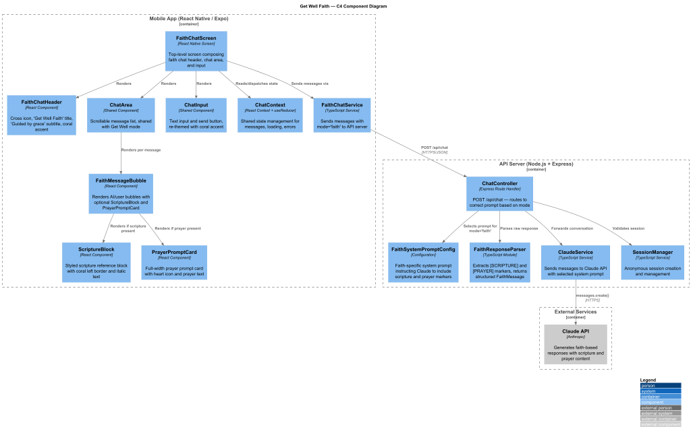
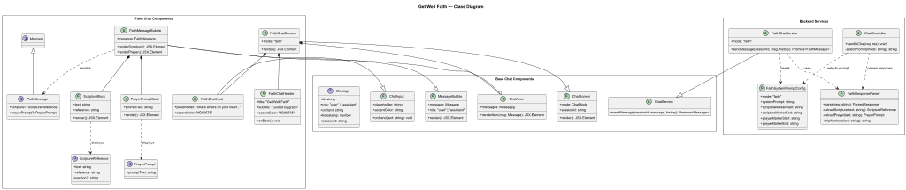
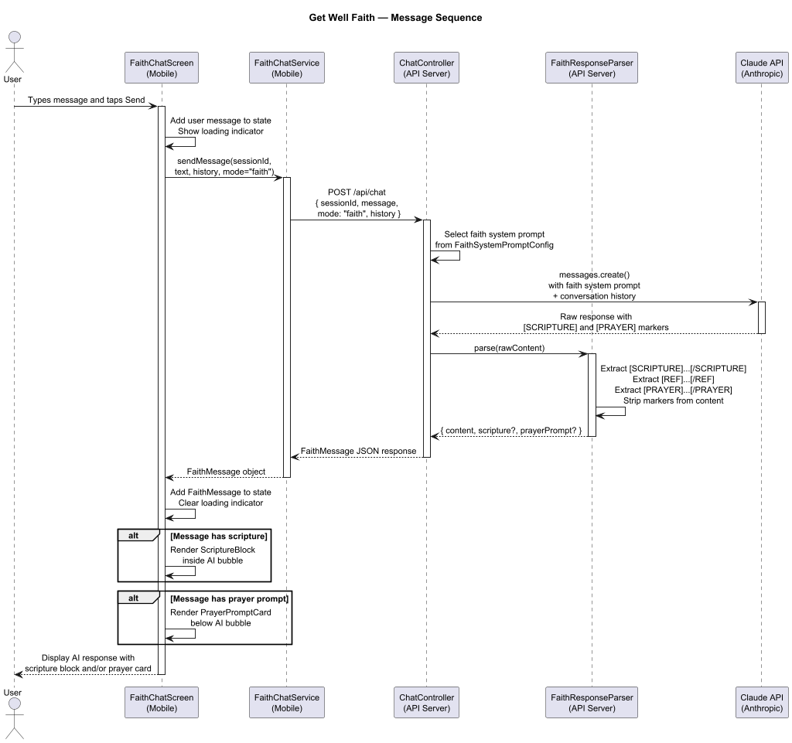

# Detailed Design: Chat Interface — Get Well Faith Mode

## Requirements Traceability

| Requirement | Description |
|---|---|
| L1-3 | Christian-values-based AI chat with prayer prompts and scripture references |
| L2-3.1 | Scripture references styled distinctly, prayer prompts visually identifiable, layout mirrors Get Well mode |
| L2-3.2 | Distinct visual identity — cross icon, coral accent #D89575, "Get Well Faith" header, "Guided by grace" subtitle |
| L2-3.3 | Same input experience, placeholder "Share what's on your heart..." |

---

## 1. Overview

Get Well Faith mode provides Christian-values-based emotional support through an AI chat interface. It shares the core chat architecture with the general Get Well mode but introduces faith-specific visual elements (scripture blocks, prayer prompt cards) and a distinct backend system prompt that instructs the Claude API to include scripture references and prayer guidance when appropriate.

### How Faith Mode Differs from General Mode

| Aspect | Get Well (General) | Get Well Faith |
|---|---|---|
| Accent Color | Green #3D8A5A | Coral #D89575 |
| Header Title | "Get Well" | "Get Well Faith" |
| Header Subtitle | "Here for you" | "Guided by grace" |
| Header Icon | Leaf icon | Cross icon ✝ / Book-open icon |
| AI System Prompt | Empathetic general support | Faith-based support with scripture and prayer |
| Special UI Blocks | None | ScriptureBlock, PrayerPromptCard |
| Input Placeholder | "How are you feeling?" | "Share what's on your heart..." |
| Avatar Background | Green-tinted | Coral-tinted #FEF0E8 |

### Shared vs. Unique Components

**Shared with Get Well mode:**
- `ChatInput` — text input field and send button (re-themed)
- `MessageBubble` — base bubble layout and positioning logic
- `ChatArea` — scrollable message list with auto-scroll
- `ChatScreen` — overall screen layout pattern (header + chat area + input)
- Session management and anonymous session handling
- Crisis detection integration (L1-4)

**Unique to Faith mode:**
- `FaithChatHeader` — cross icon, coral accent, "Guided by grace" subtitle
- `ScriptureBlock` — styled scripture reference inside AI bubbles
- `PrayerPromptCard` — full-width prayer prompt card
- `FaithMessageBubble` — extends MessageBubble to render scripture and prayer blocks
- `FaithChatService` — faith-specific system prompt for Claude API
- Response parser for extracting scripture and prayer markers from AI responses

---

## 2. Architecture

### Component Diagram



### Class Diagram



### Sequence Diagram



---

## 3. Components

### 3.1 FaithChatScreen

The top-level screen component. Reuses the same layout pattern as `ChatScreen` (header, chat area, input) but composes faith-specific subcomponents.

```
FaithChatScreen
├── FaithChatHeader
├── CoralAccentLine (2px, #D89575)
├── ChatArea
│   ├── FaithMessageBubble (AI)
│   │   ├── message text
│   │   ├── ScriptureBlock (conditional)
│   │   └── PrayerPromptCard (conditional)
│   └── FaithMessageBubble (User)
└── FaithChatInput
```

**Props:** Navigation props from React Navigation.

**State:** Managed via `ChatContext` (shared reducer) with `mode: 'faith'` flag.

**Behavior:**
- On mount, initializes a new anonymous session with `mode: 'faith'`.
- Passes `mode: 'faith'` to the chat service so the backend selects the faith system prompt.
- Renders messages using `FaithMessageBubble` which handles scripture and prayer rendering.

### 3.2 FaithChatHeader

Displays the faith mode identity at the top of the screen.

**Layout:**
- Left: Back chevron icon (navigates to mode selection)
- Center-left: Cross text "✝" rendered in coral #D89575
- Center: Title "Get Well Faith" at 18px semibold, subtitle "Guided by grace" at 12px #9C9B99
- Right: Book-open icon in coral #D89575

**Styling:**
- Background: cream (#FAF9F7 or app background)
- All interactive elements have minimum 44px touch targets

### 3.3 ScriptureBlock

Renders a scripture reference inside an AI message bubble with distinct visual treatment.

**Layout:**
- Container: background #FEF0E8, border-radius 8px, left border 3px solid #D89575
- Scripture text: 13px, italic, color #D89575
- Reference line: "— 1 Peter 5:7" at 11px, semibold, color #D89575
- Padding: 10px 12px

**Props:**
- `text: string` — the scripture passage text
- `reference: string` — the book/chapter/verse reference

### 3.4 PrayerPromptCard

Full-width card rendered below an AI message when the AI suggests a prayer.

**Layout:**
- Container: background #FEF0E8, border-radius 12px, padding 12px 16px
- Header row: Heart icon (#D89575) + "Prayer Prompt" label at 13px semibold, color #D89575
- Prayer text: 13px, color #6D6C6A, below header row

**Props:**
- `promptText: string` — the prayer prompt content

### 3.5 FaithMessageBubble

Extends the base `MessageBubble` component to handle faith-specific content blocks.

**AI Bubble:**
- Avatar: 36px circle, background #FEF0E8, heart icon #D89575
- Bubble: white background, border-radius 16px
- Message text: 14px, standard dark text
- If the message contains a scripture reference, renders `ScriptureBlock` within the bubble
- Timestamp below in muted color

**User Bubble:**
- Background: #D89575 (coral)
- Text: white
- Timestamp: #FEF0E8
- Right-aligned, border-radius 16px

### 3.6 FaithChatInput

Reuses the base `ChatInput` component with faith-specific theming.

**Differences from base:**
- Placeholder text: "Share what's on your heart..."
- Send button background: #D89575 (coral)
- Send button icon: white arrow/send icon

---

## 4. Interfaces & Types

### 4.1 FaithMessage

Extends the base `Message` interface with optional faith-specific fields.

```typescript
interface Message {
  id: string;
  role: 'user' | 'assistant';
  content: string;
  timestamp: number;
  sessionId: string;
}

interface ScriptureReference {
  text: string;        // "Cast all your anxiety on him because he cares for you."
  reference: string;   // "1 Peter 5:7"
  version?: string;    // "NIV" (optional, defaults to NIV)
}

interface PrayerPrompt {
  promptText: string;  // "Lord, I lift up this worry to You..."
}

interface FaithMessage extends Message {
  scripture?: ScriptureReference;
  prayerPrompt?: PrayerPrompt;
}
```

### 4.2 FaithChatState

```typescript
interface FaithChatState {
  messages: FaithMessage[];
  isLoading: boolean;
  sessionId: string;
  mode: 'faith';
  error: string | null;
}
```

### 4.3 FaithSystemPromptConfig

```typescript
interface FaithSystemPromptConfig {
  mode: 'faith';
  systemPrompt: string;
  scriptureMarkerStart: string;  // e.g., "[SCRIPTURE]"
  scriptureMarkerEnd: string;    // e.g., "[/SCRIPTURE]"
  prayerMarkerStart: string;     // e.g., "[PRAYER]"
  prayerMarkerEnd: string;       // e.g., "[/PRAYER]"
  referenceMarker: string;       // e.g., "[REF]...[/REF]"
}
```

---

## 5. Services

### 5.1 FaithChatService

Handles communication with the backend for faith mode conversations.

**Key difference from general ChatService:** Sends `mode: 'faith'` in the request body so the backend selects the appropriate system prompt.

```typescript
class FaithChatService {
  async sendMessage(
    sessionId: string,
    message: string,
    conversationHistory: FaithMessage[]
  ): Promise<FaithMessage>;
}
```

The service calls the same `/api/chat` endpoint but includes `{ mode: 'faith' }` in the request payload.

### 5.2 FaithResponseParser

Parses the raw Claude API response to extract structured scripture and prayer data.

```typescript
class FaithResponseParser {
  static parse(rawContent: string): {
    content: string;
    scripture?: ScriptureReference;
    prayerPrompt?: PrayerPrompt;
  };
}
```

**Parsing logic:**
1. Scan for `[SCRIPTURE]...[/SCRIPTURE]` markers in the response.
2. Within a scripture block, extract `[REF]...[/REF]` for the reference string.
3. Scan for `[PRAYER]...[/PRAYER]` markers for prayer prompts.
4. Strip all markers from the `content` field for display as regular text.
5. Return structured data for the UI to render specialized components.

---

## 6. Backend

### 6.1 Faith System Prompt

The backend maintains a separate system prompt for faith mode that instructs Claude to:

- Respond with empathy grounded in Christian values
- Include relevant scripture references when appropriate (not forced into every response)
- Offer prayer prompts when the user expresses a need that could benefit from prayer
- Use structured markers so the frontend can render scripture and prayer blocks
- Maintain the same warm, non-judgmental tone as general mode
- Never proselytize or pressure — meet the user where they are
- Still trigger crisis detection for safety-critical messages

**System prompt excerpt (illustrative):**

```
You are a compassionate faith-based emotional support companion. You provide
warm, empathetic support grounded in Christian values. When appropriate, you
may include a relevant scripture reference using the format:
[SCRIPTURE]scripture text here[REF]Book Chapter:Verse[/REF][/SCRIPTURE]

When the conversation calls for it, you may offer a prayer prompt:
[PRAYER]A gentle prayer suggestion here[/PRAYER]

Do not force scripture or prayer into every response. Let the conversation
guide when these are appropriate. Always prioritize the person's emotional
wellbeing. If you detect crisis signals, prioritize safety above all else.
```

### 6.2 Chat Controller — Faith Mode Handling

The existing `/api/chat` endpoint handles both modes:

```
POST /api/chat
{
  sessionId: string,
  message: string,
  mode: "general" | "faith",
  conversationHistory: Message[]
}
```

**Flow:**
1. Controller receives request with `mode: 'faith'`.
2. Selects the faith system prompt from configuration.
3. Calls Claude API with the faith system prompt + conversation history.
4. Passes raw response through `FaithResponseParser` on the backend.
5. Returns structured `FaithMessage` to the client.

### 6.3 Response Parsing on Backend

Parsing happens server-side so the mobile client receives clean, structured data:

```json
{
  "id": "msg_abc123",
  "role": "assistant",
  "content": "I hear you, and I want you to know that you don't have to carry this alone.",
  "timestamp": 1711700000000,
  "sessionId": "sess_xyz",
  "scripture": {
    "text": "Cast all your anxiety on him because he cares for you.",
    "reference": "1 Peter 5:7",
    "version": "NIV"
  },
  "prayerPrompt": {
    "promptText": "Lord, I lift up this burden to You. Grant peace and clarity in this moment of struggle. Amen."
  }
}
```

---

## 7. State Management

Faith mode uses the shared `ChatContext` with the `useReducer` pattern. The reducer handles the same action types as general mode, with the faith-specific fields flowing through transparently:

- `SEND_MESSAGE` — adds a user message
- `RECEIVE_MESSAGE` — adds an AI response (with optional `scripture` and `prayerPrompt`)
- `SET_LOADING` — toggles loading indicator
- `SET_ERROR` — handles error states
- `CLEAR_CHAT` — resets conversation

The `mode: 'faith'` flag in state ensures the correct service and UI components are used.

---

## 8. Navigation

Faith chat is reached from the Welcome/Onboarding screen (L1-1) via mode selection:

```
WelcomeScreen → (user taps "Get Well Faith") → FaithChatScreen
```

The back chevron in `FaithChatHeader` navigates back to the Welcome screen. The screen is registered in React Navigation's stack:

```typescript
<Stack.Screen name="FaithChat" component={FaithChatScreen} />
```

---

## 9. Visual Design Tokens

| Token | Value | Usage |
|---|---|---|
| `faith.accent` | #D89575 | Primary coral accent |
| `faith.accentLight` | #FEF0E8 | Avatar bg, scripture bg, prayer card bg |
| `faith.textOnAccent` | #FFFFFF | User bubble text |
| `faith.timestampOnAccent` | #FEF0E8 | User bubble timestamp |
| `faith.subtitle` | #9C9B99 | Header subtitle color |
| `faith.prayerText` | #6D6C6A | Prayer prompt body text |
| `faith.bubbleAI` | #FFFFFF | AI message bubble background |
| `faith.bubbleUser` | #D89575 | User message bubble background |
| `faith.borderRadius.bubble` | 16px | Message bubble corners |
| `faith.borderRadius.scripture` | 8px | Scripture block corners |
| `faith.borderRadius.prayer` | 12px | Prayer prompt card corners |
| `faith.accentLine` | 2px | Header accent line thickness |

---

## 10. Accessibility

- All icons include accessible labels (cross icon: "Faith mode", book-open: "Scripture resources").
- Scripture blocks use `accessibilityRole="text"` with the full scripture and reference read together.
- Prayer prompt cards are announced as a group: "Prayer Prompt: [text]".
- Color contrast ratios meet WCAG AA for all text on background combinations.
- Minimum touch targets of 44x44px on all interactive elements.
- Chat area supports VoiceOver/TalkBack navigation between messages.

---

## 11. Error Handling

- Network errors display a gentle inline message: "We couldn't connect right now. Please try again."
- If Claude API fails to return, the UI shows a retry option without losing the user's message.
- Malformed marker parsing (e.g., missing closing tags) falls back to rendering the raw text as a normal message — no scripture/prayer blocks shown, but the message is never lost.
- Session expiration is handled transparently by creating a new session.

---

## 12. Testing Strategy

- **Unit tests:** FaithResponseParser — verify correct extraction of scripture and prayer markers from various response formats, including edge cases (no markers, nested markers, malformed markers).
- **Unit tests:** ScriptureBlock and PrayerPromptCard — verify correct rendering with various text lengths.
- **Integration tests:** FaithChatService — verify `mode: 'faith'` is sent in requests and structured responses are returned.
- **Snapshot tests:** FaithChatHeader, FaithMessageBubble — verify visual consistency.
- **E2E tests:** Full faith conversation flow — send message, receive response with scripture, verify ScriptureBlock renders. Send message, receive prayer prompt, verify PrayerPromptCard renders.

---

## Diagrams

### Class Diagram


### Sequence Diagram


### C4 Component Diagram


