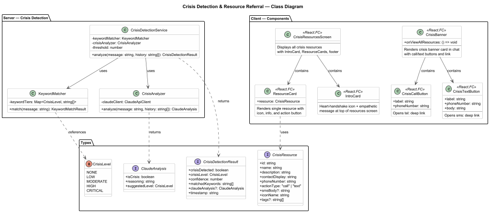
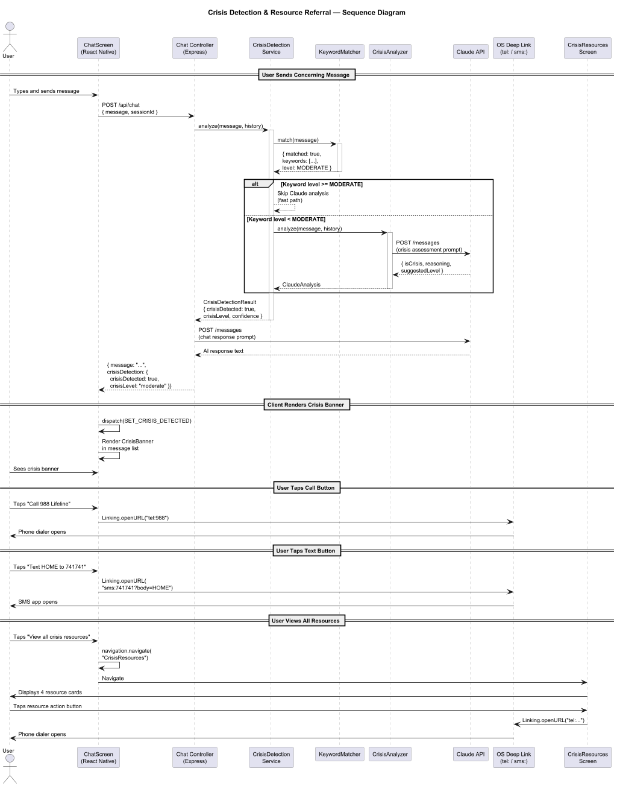
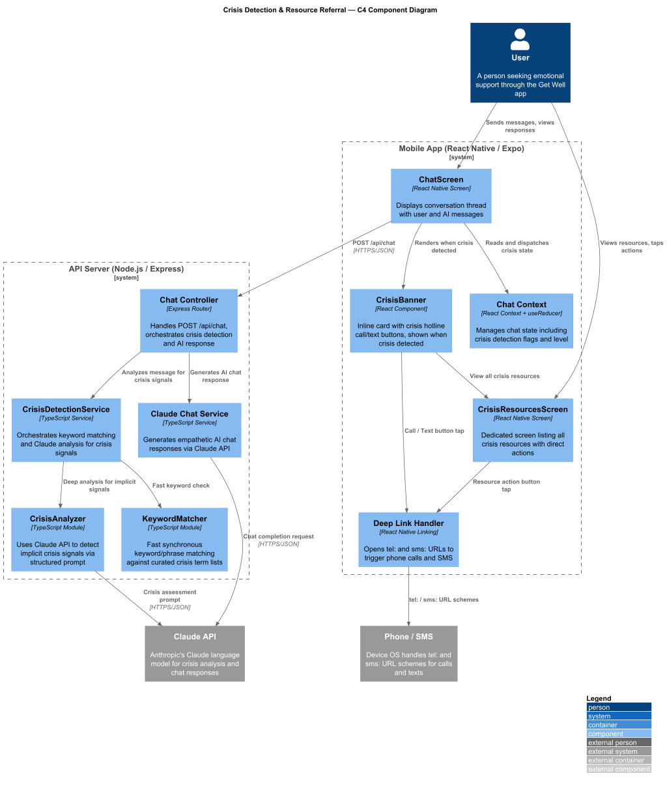

# Detailed Design: Crisis Detection & Resource Referral

## 1. Overview

### 1.1 Purpose

The Crisis Detection & Resource Referral feature protects users by identifying crisis signals in conversation and presenting life-saving resources with compassionate, non-alarming routing. When the system detects that a user may be in distress, it surfaces a crisis banner directly in the chat and provides a dedicated screen listing multiple crisis hotlines with tap-to-call and tap-to-text actions.

Safety is the top priority: the system always errs on the side of showing resources. Resources are never suppressed once a crisis signal is detected in a session.

### 1.2 Requirements Traceability

| Requirement | Description |
|-------------|-------------|
| L1-4 | Detect crisis signals in conversation, present crisis resources with compassionate routing |
| L2-4.1 | Crisis banner in chat -- visually prominent but not alarming, includes 988 Lifeline and Crisis Text Line, tap-to-call/text |
| L2-4.2 | Dedicated crisis resources screen accessible from banner or navigation, lists multiple resources with direct actions |

### 1.3 User Flow

1. User sends a message containing crisis signals (explicit or implicit).
2. The backend `CrisisDetectionService` analyzes the message before generating the AI response.
3. If crisis signals are detected, the API response includes a `crisisDetected` flag and metadata.
4. The client renders a `CrisisBanner` card inline in the chat message list.
5. User can tap "Call 988 Lifeline" to initiate a phone call via `tel:` deep link.
6. User can tap "Text HOME to 741741" to open SMS via `sms:` deep link.
7. User can tap "View all crisis resources" to navigate to the `CrisisResourcesScreen`.
8. The `CrisisResourcesScreen` lists four resource cards with direct call/text actions.

### 1.4 Feature Scope

- Server-side crisis signal detection via keyword matching and Claude API analysis.
- Inline crisis banner displayed in the chat conversation.
- Dedicated crisis resources screen with multiple hotlines.
- Deep linking for phone calls (`tel:`) and text messages (`sms:`).
- Crisis state management within the chat context.
- Safety-first design: once detected, the banner remains visible for the session.

---

## 2. Component Architecture



### 2.1 Component Tree

```
ChatScreen
└── MessageList
    ├── MessageBubble (user)
    ├── MessageBubble (AI)
    └── CrisisBanner
        ├── BannerHeader (triangle-alert icon + "You're not alone")
        ├── BannerDescription
        ├── CrisisCallButton ("Call 988 Lifeline")
        ├── CrisisTextButton ("Text HOME to 741741")
        └── CrisisResourcesLink ("View all crisis resources")

CrisisResourcesScreen
├── ScreenHeader ("Crisis Resources")
├── IntroCard
│   ├── HeartHandshakeIcon
│   ├── Title ("You're not alone")
│   └── Description
├── ResourceCard (988 Suicide & Crisis Lifeline)
├── ResourceCard (Crisis Text Line)
├── ResourceCard (SAMHSA Helpline)
├── ResourceCard (Trevor Project)
└── Footer ("Reaching out is a sign of strength...")
```

### 2.2 CrisisBanner

An inline card rendered within the chat message list when crisis signals are detected.

| Aspect | Detail |
|--------|--------|
| **File** | `src/components/crisis/CrisisBanner.tsx` |
| **Type** | Functional component (React.FC) |
| **Props** | `CrisisBannerProps` (see Interfaces below) |
| **Behavior** | Renders crisis resource actions. Tap call button opens `tel:988`. Tap text button opens `sms:741741?body=HOME`. Tap link navigates to `CrisisResources` screen. |
| **Visibility** | Once rendered, the banner is never removed from the session. |

**Visual Spec:**
- White background, rounded 16, shadow, 2px coral border (`#D08068`)
- Padding 16, gap 10 between elements

### 2.3 CrisisCallButton

A primary action button for calling a crisis hotline.

| Aspect | Detail |
|--------|--------|
| **File** | `src/components/crisis/CrisisCallButton.tsx` |
| **Props** | `{ label: string; phoneNumber: string }` |
| **Behavior** | On press, opens `tel:{phoneNumber}` via `Linking.openURL`. |
| **Style** | Coral background (`#D08068`), rounded 100, 44px height, phone icon + white text |
| **Accessibility** | `accessibilityRole="button"`, `accessibilityLabel` includes phone number |

### 2.4 CrisisTextButton

An outlined action button for texting a crisis line.

| Aspect | Detail |
|--------|--------|
| **File** | `src/components/crisis/CrisisTextButton.tsx` |
| **Props** | `{ label: string; phoneNumber: string; body: string }` |
| **Behavior** | On press, opens `sms:{phoneNumber}?body={body}` via `Linking.openURL`. |
| **Style** | White background, coral border (`#D08068`), rounded 100, 44px height, coral text |
| **Accessibility** | `accessibilityRole="button"`, `accessibilityLabel` includes instruction text |

### 2.5 CrisisResourcesScreen

A dedicated screen listing all available crisis resources.

| Aspect | Detail |
|--------|--------|
| **File** | `src/screens/CrisisResourcesScreen.tsx` |
| **Type** | Functional component (React.FC) |
| **Navigation** | Registered as `"CrisisResources"` in the root `StackNavigator` |
| **State** | Stateless; reads resource data from `CRISIS_RESOURCES` constant |
| **Behavior** | Renders intro card, four `ResourceCard` components, and footer. Header has back chevron + title. |

### 2.6 ResourceCard

A card displaying a single crisis resource with a direct action button.

| Aspect | Detail |
|--------|--------|
| **File** | `src/components/crisis/ResourceCard.tsx` |
| **Props** | `ResourceCardProps` (see Interfaces below) |
| **Behavior** | Displays resource name, description, contact info. Action button triggers `tel:` or `sms:` deep link. |
| **Style** | White background, rounded 16, shadow, padding 16. Icon circle: 44px, green background (`#C8F0D8`), green icon (`#3D8A5A`). Green action button (`#3D8A5A`). |

### 2.7 IntroCard

A header card on the `CrisisResourcesScreen` with an empathetic message.

| Aspect | Detail |
|--------|--------|
| **File** | `src/components/crisis/IntroCard.tsx` |
| **Props** | None |
| **Renders** | Heart-handshake icon (`#D08068`), title "You're not alone" (22px semibold), description about free/confidential/24/7 resources |
| **Style** | White background, rounded 16, shadow |

---

## 3. Interfaces and Types

### 3.1 CrisisLevel

```typescript
enum CrisisLevel {
  NONE = 'none',
  LOW = 'low',
  MODERATE = 'moderate',
  HIGH = 'high',
  CRITICAL = 'critical',
}
```

### 3.2 CrisisResource

```typescript
interface CrisisResource {
  id: string;
  name: string;
  description: string;
  contactDisplay: string;      // e.g., "Call or text 988"
  phoneNumber: string;         // e.g., "988"
  actionType: 'call' | 'text';
  smsBody?: string;            // Pre-filled SMS body (e.g., "HOME")
  iconName: string;            // Icon identifier (e.g., 'phone', 'message-circle')
  tags?: string[];             // e.g., ['LGBTQ+', 'youth']
}
```

### 3.3 CrisisDetectionResult

```typescript
interface CrisisDetectionResult {
  crisisDetected: boolean;
  crisisLevel: CrisisLevel;
  confidence: number;          // 0.0 - 1.0
  matchedKeywords: string[];
  claudeAnalysis?: {
    isCrisis: boolean;
    reasoning: string;
    suggestedLevel: CrisisLevel;
  };
  timestamp: string;           // ISO 8601
}
```

### 3.4 CrisisBannerProps

```typescript
interface CrisisBannerProps {
  onViewAllResources: () => void;
}
```

### 3.5 ResourceCardProps

```typescript
interface ResourceCardProps {
  resource: CrisisResource;
}
```

### 3.6 CrisisState (Chat Context)

```typescript
interface CrisisState {
  crisisDetected: boolean;
  crisisLevel: CrisisLevel;
  bannerDismissable: false;    // Always false -- banner cannot be dismissed
  detectionResult?: CrisisDetectionResult;
}
```

### 3.7 CRISIS_RESOURCES Constant

```typescript
const CRISIS_RESOURCES: CrisisResource[] = [
  {
    id: '988-lifeline',
    name: '988 Suicide & Crisis Lifeline',
    description: 'Free, confidential, 24/7 support for people in distress.',
    contactDisplay: 'Call or text 988',
    phoneNumber: '988',
    actionType: 'call',
    iconName: 'phone',
  },
  {
    id: 'crisis-text-line',
    name: 'Crisis Text Line',
    description: 'Free, 24/7 text-based crisis support.',
    contactDisplay: 'Text HOME to 741741',
    phoneNumber: '741741',
    actionType: 'text',
    smsBody: 'HOME',
    iconName: 'message-circle',
  },
  {
    id: 'samhsa',
    name: 'SAMHSA Helpline',
    description: 'Free referral and information service for substance abuse and mental health.',
    contactDisplay: '1-800-662-4357',
    phoneNumber: '18006624357',
    actionType: 'call',
    iconName: 'phone',
  },
  {
    id: 'trevor-project',
    name: 'Trevor Project',
    description: 'Crisis support for LGBTQ+ young people.',
    contactDisplay: '1-866-488-7386 (LGBTQ+)',
    phoneNumber: '18664887386',
    actionType: 'call',
    iconName: 'phone',
    tags: ['LGBTQ+', 'youth'],
  },
];
```

---

## 4. Crisis Detection Service

### 4.1 Architecture

The `CrisisDetectionService` runs server-side on the Node.js/Express backend. It analyzes every incoming user message before the Claude API generates a response. This ensures crisis resources are presented regardless of how the AI responds.

```
User Message → Chat Controller → CrisisDetectionService → Claude API (chat)
                                        │
                                        ├── KeywordMatcher (fast, synchronous)
                                        └── CrisisAnalyzer (Claude API, async)
```

### 4.2 KeywordMatcher

A fast, synchronous first-pass analysis using keyword and phrase matching.

| Aspect | Detail |
|--------|--------|
| **File** | `src/services/crisis/KeywordMatcher.ts` |
| **Input** | User message text |
| **Output** | `{ matched: boolean; keywords: string[]; level: CrisisLevel }` |
| **Behavior** | Checks message against curated keyword lists organized by severity tier. Case-insensitive, handles common misspellings and abbreviations. |

**Keyword Tiers:**

| Tier | Crisis Level | Example Keywords/Phrases |
|------|-------------|--------------------------|
| Critical | `CRITICAL` | "kill myself", "end my life", "suicide plan", "want to die" |
| High | `HIGH` | "self-harm", "cutting", "overdose", "no reason to live" |
| Moderate | `MODERATE` | "hopeless", "can't go on", "nobody cares", "better off without me" |
| Low | `LOW` | "really struggling", "don't know what to do", "falling apart" |

### 4.3 CrisisAnalyzer

A Claude API-powered analysis for detecting implicit crisis signals that keyword matching would miss.

| Aspect | Detail |
|--------|--------|
| **File** | `src/services/crisis/CrisisAnalyzer.ts` |
| **Input** | User message text, recent conversation history (last 5 messages) |
| **Output** | `{ isCrisis: boolean; reasoning: string; suggestedLevel: CrisisLevel }` |
| **Behavior** | Sends a structured prompt to Claude API asking it to assess crisis risk. Uses a dedicated system prompt focused on safety assessment. |

**Claude Analysis Prompt (simplified):**

```
You are a crisis detection system. Analyze the following message for signs
of suicidal ideation, self-harm intent, or acute emotional crisis.

Consider both explicit statements and implicit signals such as:
- Expressions of hopelessness or worthlessness
- Farewell or goodbye language
- Giving away possessions
- Sudden calmness after prolonged distress
- Indirect references to not being around

Respond with JSON: { isCrisis: boolean, reasoning: string, suggestedLevel: "none"|"low"|"moderate"|"high"|"critical" }
```

### 4.4 CrisisDetectionService (Orchestrator)

| Aspect | Detail |
|--------|--------|
| **File** | `src/services/crisis/CrisisDetectionService.ts` |
| **Behavior** | Runs `KeywordMatcher` first (fast path). If keywords match at `MODERATE` or above, returns immediately without waiting for Claude analysis. For `LOW` or `NONE` keyword results, runs `CrisisAnalyzer` for deeper analysis. Combines results and returns the higher severity level. |

### 4.5 Confidence Scoring and Threshold

| Source | Weight | Threshold |
|--------|--------|-----------|
| Keyword match (Critical/High) | 1.0 | Always triggers |
| Keyword match (Moderate) | 0.8 | Always triggers |
| Keyword match (Low) | 0.4 | Triggers Claude analysis |
| Claude analysis (isCrisis: true) | 0.7-0.9 | Triggers if combined >= 0.5 |
| No match, no Claude signal | 0.0 | No trigger |

The detection threshold is set to **0.5** confidence. This deliberately low threshold ensures the system errs on the side of safety.

### 4.6 Safety Principles

- **Always show, never suppress:** Once crisis is detected in a session, resources remain visible.
- **Fast path for critical signals:** Keyword matches at `MODERATE` or above trigger instantly without waiting for Claude analysis.
- **No false negatives over false positives:** The system accepts false positives (showing resources when not needed) to avoid missing a genuine crisis.
- **No content filtering:** The AI response is still generated normally. Crisis detection adds resources alongside the response; it does not block or alter the conversation.
- **Logging without PII:** Crisis detection events are logged for monitoring (detection level, confidence, timestamp) but never include the user's message content.

---

## 5. Deep Linking

### 5.1 URL Schemes

| Action | URL | Platform Behavior |
|--------|-----|-------------------|
| Call 988 | `tel:988` | Opens phone dialer with 988 pre-filled |
| Call SAMHSA | `tel:18006624357` | Opens phone dialer |
| Call Trevor Project | `tel:18664887386` | Opens phone dialer |
| Text Crisis Text Line | `sms:741741?body=HOME` | Opens SMS app with number and body pre-filled |

### 5.2 Implementation

```typescript
import { Linking, Platform } from 'react-native';

const handleCall = (phoneNumber: string): void => {
  Linking.openURL(`tel:${phoneNumber}`);
};

const handleText = (phoneNumber: string, body: string): void => {
  const separator = Platform.OS === 'ios' ? '&' : '?';
  Linking.openURL(`sms:${phoneNumber}${separator}body=${encodeURIComponent(body)}`);
};
```

Note: iOS uses `sms:number&body=text` while Android uses `sms:number?body=text`. The implementation handles this platform difference.

---

## 6. State Management

### 6.1 Crisis State in Chat Context

Crisis state is managed within the existing chat context using `useReducer`.

```typescript
// Chat context actions
type ChatAction =
  | { type: 'SET_CRISIS_DETECTED'; payload: CrisisDetectionResult }
  | { type: 'CLEAR_CRISIS' }  // Only used on session reset
  | /* ...other chat actions */;

// Reducer logic
case 'SET_CRISIS_DETECTED':
  return {
    ...state,
    crisis: {
      crisisDetected: true,
      crisisLevel: action.payload.crisisLevel,
      bannerDismissable: false,
      detectionResult: action.payload,
    },
  };
```

### 6.2 Banner Visibility Rules

| Rule | Behavior |
|------|----------|
| Crisis detected in current message | Banner appears immediately below the AI response |
| Crisis previously detected in session | Banner remains visible (pinned at detection point in chat) |
| User scrolls past banner | Banner stays in place; does not float or follow scroll |
| New session started | Crisis state resets |
| User navigates away and returns | Banner remains if session is active |

### 6.3 API Response Shape

```typescript
interface ChatApiResponse {
  message: string;              // AI response text
  crisisDetection?: {
    crisisDetected: boolean;
    crisisLevel: CrisisLevel;
    confidence: number;
  };
}
```

---

## 7. Styling and Design Tokens

### 7.1 Crisis Banner

| Token | Value |
|-------|-------|
| Background | `#FFFFFF` |
| Border | 2px solid `#D08068` |
| Border radius | 16 |
| Padding | 16 |
| Gap | 10 |
| Shadow | elevation 2 |

| Element | Size | Weight | Color |
|---------|------|--------|-------|
| Header text ("You're not alone") | 16px | SemiBold (600) | `#D08068` |
| Header icon (triangle-alert) | 20px | -- | `#D08068` |
| Description | 13px | Regular (400) | `#6D6C6A` |
| Call button text | 14px | SemiBold (600) | `#FFFFFF` |
| Text button text | 14px | SemiBold (600) | `#D08068` |
| Resource link | 13px | Regular (400) | `#3D8A5A` |

| Button | Background | Border | Height | Border Radius |
|--------|------------|--------|--------|---------------|
| Call 988 Lifeline | `#D08068` | none | 44px | 100 |
| Text HOME to 741741 | transparent | 1px `#D08068` | 44px | 100 |

### 7.2 Crisis Resources Screen

| Token | Value |
|-------|-------|
| Screen background | `#F5F4F1` |
| Content padding (horizontal) | 24 |
| Content gap (vertical) | 16 |

| Element | Size | Weight | Color |
|---------|------|--------|-------|
| Header title ("Crisis Resources") | 18px | SemiBold (600) | `#1A1918` |
| Intro title ("You're not alone") | 22px | SemiBold (600) | `#1A1918` |
| Intro description | 14px | Regular (400) | `#6D6C6A` |
| Intro icon (heart-handshake) | 32px | -- | `#D08068` |
| Resource name | 16px | SemiBold (600) | `#1A1918` |
| Resource description | 13px | Regular (400) | `#6D6C6A` |
| Resource contact | 13px | Medium (500) | `#6D6C6A` |
| Action button text | 14px | SemiBold (600) | `#FFFFFF` |
| Footer text | 13px | Italic (400) | `#9C9B99` |

### 7.3 Resource Card Dimensions

| Element | Dimension |
|---------|-----------|
| Card border radius | 16 |
| Card padding | 16 |
| Card shadow | elevation 2 |
| Icon circle | 44 x 44, borderRadius 22 |
| Icon circle background | `#C8F0D8` |
| Icon color | `#3D8A5A` |
| Action button background | `#3D8A5A` |
| Action button height | 36px |
| Action button border radius | 100 |

### 7.4 Colors

| Name | Hex | Usage |
|------|-----|-------|
| Coral Accent | `#D08068` | Crisis banner border, header, call button, icon |
| Green Accent | `#3D8A5A` | Resource link, resource icon, action buttons |
| Green Light | `#C8F0D8` | Resource icon circle background |
| Text Primary | `#1A1918` | Titles, resource names |
| Text Secondary | `#6D6C6A` | Descriptions, contact info |
| Text Muted | `#9C9B99` | Footer text |
| Background | `#F5F4F1` | Screen background |
| Card Background | `#FFFFFF` | All cards |

---

## 8. Navigation



### 8.1 Navigation Integration

The `CrisisResourcesScreen` is registered in the root `StackNavigator`:

```typescript
<Stack.Screen
  name="CrisisResources"
  component={CrisisResourcesScreen}
  options={{
    headerShown: false,
    presentation: 'card',
  }}
/>
```

### 8.2 Navigation Paths

| From | To | Trigger |
|------|----|---------|
| CrisisBanner (in chat) | CrisisResourcesScreen | Tap "View all crisis resources" link |
| Settings screen | CrisisResourcesScreen | Tap "Crisis Resources" navigation item |
| CrisisResourcesScreen | Previous screen | Tap back chevron |

### 8.3 Navigation Actions

```typescript
// From CrisisBanner
const handleViewAllResources = () => {
  navigation.navigate('CrisisResources');
};

// From CrisisResourcesScreen header
const handleBack = () => {
  navigation.goBack();
};
```

---

## 9. System Context



The Crisis Detection feature spans the Mobile App and API Server containers. The mobile app is responsible for rendering the crisis banner and resources screen, handling deep link actions (phone calls and SMS), and managing crisis state in the chat context. The API server runs the `CrisisDetectionService` pipeline, which combines fast keyword matching with Claude API analysis to detect crisis signals. External systems include the Claude API (for implicit crisis signal analysis) and the device OS (for handling `tel:` and `sms:` deep links).

---

## 10. Accessibility

| Concern | Implementation |
|---------|---------------|
| Screen reader | Crisis banner announces "Crisis resources available" when it appears. All buttons have descriptive `accessibilityLabel` values (e.g., "Call 988 Suicide and Crisis Lifeline"). |
| Touch targets | All action buttons are at least 44px tall. Resource card action buttons meet minimum 48dp touch target. |
| Color contrast | Coral text (`#D08068`) on white meets WCAG AA. White text on coral button meets WCAG AA. Green text (`#3D8A5A`) on white meets WCAG AA. |
| Focus order | Banner elements follow logical reading order: header, description, call button, text button, link. |
| Haptics | No haptic feedback on crisis actions to avoid adding stress. |

---

## 11. Testing Strategy

| Layer | Scope |
|-------|-------|
| Unit | `KeywordMatcher` correctly identifies crisis keywords across all tiers. |
| Unit | `CrisisAnalyzer` sends correct prompt to Claude API and parses response. |
| Unit | `CrisisDetectionService` combines keyword and Claude results, returns highest severity. |
| Unit | `CrisisBanner` renders header, description, call button, text button, and link. |
| Unit | `ResourceCard` renders resource name, description, contact info, and action button. |
| Unit | `CrisisCallButton` calls `Linking.openURL` with correct `tel:` URL. |
| Unit | `CrisisTextButton` calls `Linking.openURL` with correct `sms:` URL (platform-aware). |
| Integration | Chat API endpoint includes `crisisDetection` in response when crisis is detected. |
| Integration | `ChatScreen` renders `CrisisBanner` when API response includes crisis flag. |
| Integration | `CrisisBanner` "View all" link navigates to `CrisisResourcesScreen`. |
| Snapshot | `CrisisBanner` and `CrisisResourcesScreen` snapshots match expected layout. |
| E2E | Sending a crisis message triggers the banner. Tapping call button opens dialer. Tapping text button opens SMS. Tapping "View all" opens resources screen. |

---

## 12. File Manifest

```
src/
├── screens/
│   └── CrisisResourcesScreen.tsx
├── components/
│   └── crisis/
│       ├── CrisisBanner.tsx
│       ├── CrisisCallButton.tsx
│       ├── CrisisTextButton.tsx
│       ├── ResourceCard.tsx
│       └── IntroCard.tsx
├── services/
│   └── crisis/
│       ├── CrisisDetectionService.ts
│       ├── CrisisAnalyzer.ts
│       └── KeywordMatcher.ts
├── types/
│   └── crisis.ts                 # CrisisLevel, CrisisResource, CrisisDetectionResult, etc.
└── constants/
    └── crisisResources.ts        # CRISIS_RESOURCES array
```

---

## Diagrams

### Class Diagram


### Sequence Diagram


### C4 Component Diagram


