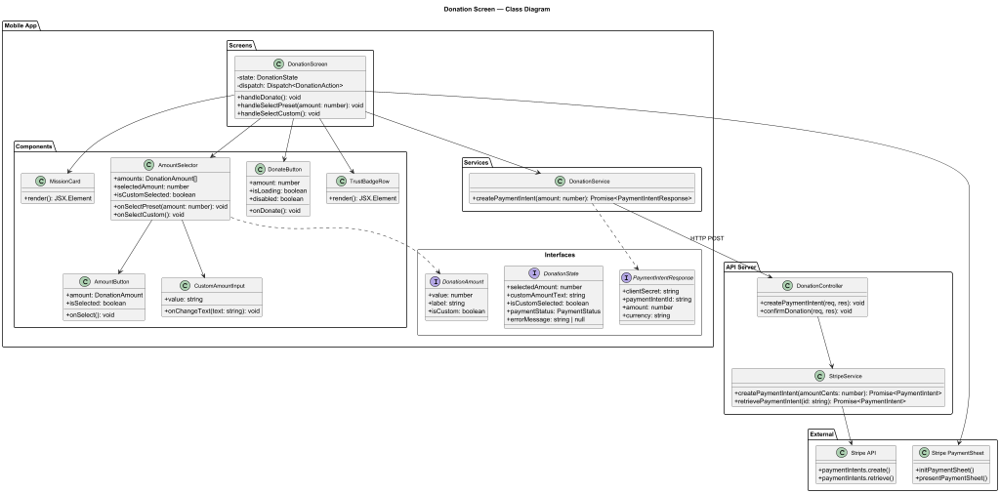
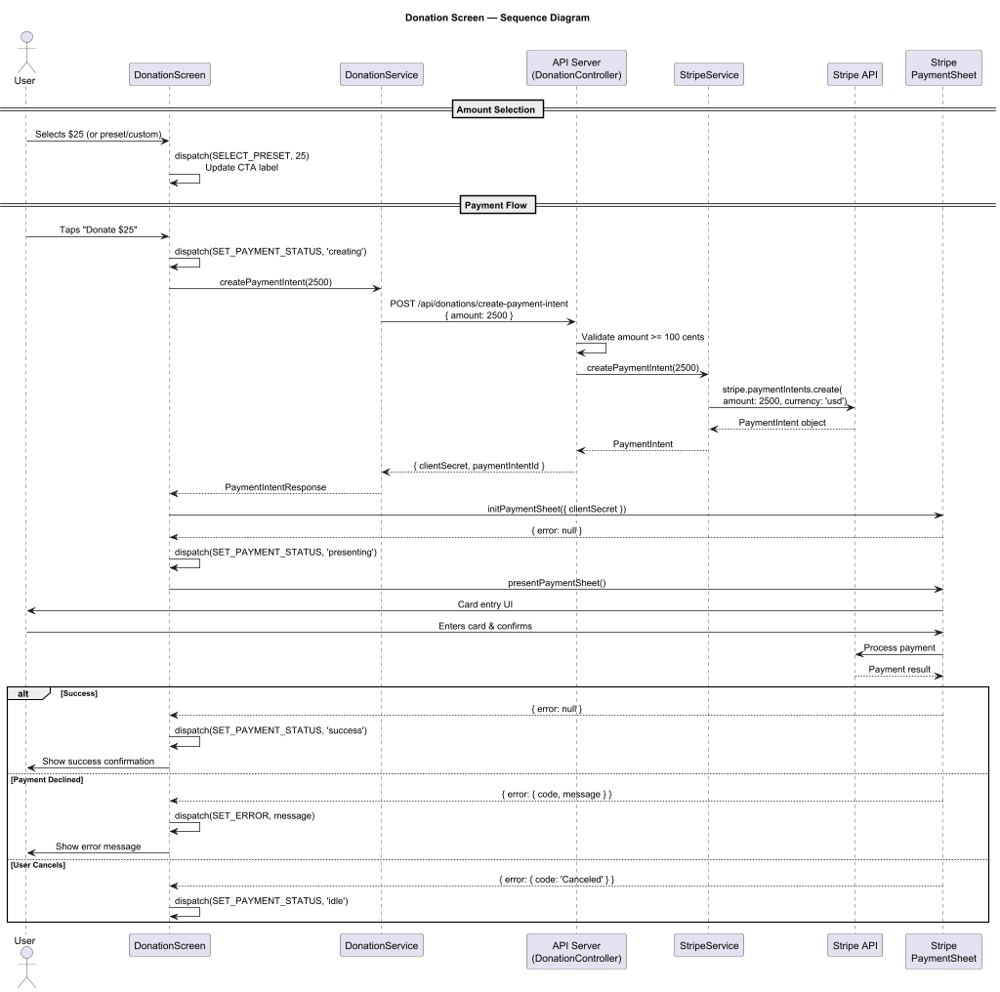
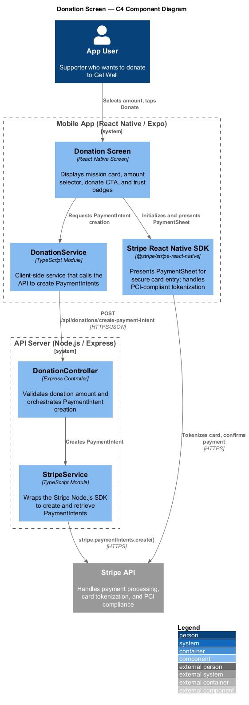

# Detailed Design: Donation Screen

## 1. Overview

### 1.1 Purpose

The Donation Screen provides a transparent, no-pressure interface for supporters to financially contribute to the Get Well 501(c)(3) nonprofit. It integrates with Stripe for secure payment processing, ensuring that no card data ever touches the Get Well server. The screen reinforces the mission -- keeping emotional support free, anonymous, and available 24/7 -- while making it easy to give.

### 1.2 Requirements Traceability

| Requirement | Description |
|-------------|-------------|
| L1-5 | Donation interface for supporters to contribute, full transparency, no pressure |
| L2-5.1 | Preset donation amounts + custom amount, clear "Donate" CTA |
| L2-5.2 | Brief mission statement, 501(c)(3) mentioned, no-pressure tone |

### 1.3 User Flow

1. User navigates to the Donation Screen from the Settings/About screen or a navigation link.
2. The `DonationScreen` renders with a mission card, amount selection buttons, a donate CTA, and trust badges.
3. User selects a preset amount ($5, $10, $25, $50, $100) or taps "Custom" to enter a custom amount.
4. User taps the "Donate $XX" button.
5. The client creates a PaymentIntent via the backend API.
6. The Stripe PaymentSheet is presented for the user to enter card details.
7. Upon successful payment, a confirmation is displayed. On failure, an error message is shown.

### 1.4 Feature Scope

- Display a mission reinforcement card with heart icon and 501(c)(3) mention.
- Provide six amount buttons: five preset ($5, $10, $25, $50, $100) and one "Custom" option.
- Show a full-width "Donate $XX" CTA button reflecting the selected amount.
- Display trust badges (Secure, Encrypted, 501(c)(3)).
- Integrate with Stripe for PCI-compliant payment processing.
- Handle loading, success, and error states gracefully.

---

## 2. Component Architecture



### 2.1 Component Tree

```
DonationScreen
├── Header (back chevron + "Support Get Well")
├── MissionCard
│   ├── HeartIcon
│   ├── Title ("Keep Get Well Free")
│   └── Description (mission text + 501(c)(3))
├── AmountSelector
│   ├── SectionLabel ("Choose an amount")
│   ├── AmountButton ($5)
│   ├── AmountButton ($10)
│   ├── AmountButton ($25)  ← default selected
│   ├── AmountButton ($50)
│   ├── AmountButton ($100)
│   └── AmountButton (Custom)
├── CustomAmountInput (conditionally rendered)
├── DonateButton ("Donate $25")
├── TrustBadgeRow
│   ├── TrustBadge (shield + "Secure")
│   ├── TrustBadge (lock + "Encrypted")
│   └── TrustBadge (heart + "501(c)(3)")
└── Footer ("Every dollar goes directly...")
```

### 2.2 DonationScreen

The root screen component registered with React Navigation.

| Aspect | Detail |
|--------|--------|
| **File** | `src/screens/DonationScreen.tsx` |
| **Type** | Functional component (React.FC) |
| **Navigation** | Registered as `"Donation"` in the root `StackNavigator` |
| **State** | Manages selected amount, custom amount input, payment processing state, and error/success feedback via `useReducer` |
| **Behavior** | Orchestrates amount selection, PaymentIntent creation, Stripe PaymentSheet presentation, and result handling. |

**Props:** Receives `navigation` and `route` from React Navigation (`NativeStackScreenProps<RootStackParamList, 'Donation'>`).

### 2.3 MissionCard

Displays the mission reinforcement message with heart icon and 501(c)(3) reference.

| Aspect | Detail |
|--------|--------|
| **File** | `src/components/donation/MissionCard.tsx` |
| **Props** | None |
| **Renders** | White card (rounded 16, shadow, padding 20) containing: heart icon (`#3D8A5A`, 24px), title "Keep Get Well Free" (22px semibold), description text mentioning 501(c)(3) status (14px, `#6D6C6A`) |

### 2.4 AmountSelector

Container for the two rows of amount selection buttons.

| Aspect | Detail |
|--------|--------|
| **File** | `src/components/donation/AmountSelector.tsx` |
| **Props** | `AmountSelectorProps` (see Interfaces below) |
| **Renders** | Section label "Choose an amount" (15px semibold) + two rows of three `AmountButton` components each. Row 1: $5, $10, $25. Row 2: $50, $100, Custom. |

### 2.5 AmountButton

An individual pressable button representing a preset amount or the "Custom" option.

| Aspect | Detail |
|--------|--------|
| **File** | `src/components/donation/AmountButton.tsx` |
| **Props** | `AmountButtonProps` (see Interfaces below) |
| **Behavior** | On press, invokes `onSelect` callback with the amount value. Visually toggles between selected (green bg `#3D8A5A`, white text) and unselected (white bg, border `#E5E4E1`, dark text) styles. |
| **Dimensions** | 52px height, borderRadius 12, flex: 1 within row |
| **Accessibility** | `accessibilityRole="button"`, `accessibilityState={{ selected }}` |

### 2.6 CustomAmountInput

A text input field that appears when the user taps the "Custom" amount button.

| Aspect | Detail |
|--------|--------|
| **File** | `src/components/donation/CustomAmountInput.tsx` |
| **Props** | `CustomAmountInputProps` (see Interfaces below) |
| **Behavior** | Renders a dollar-sign-prefixed `TextInput` with `keyboardType="numeric"`. Validates input to allow only positive numbers. Updates parent state on change. |
| **Dimensions** | 52px height, borderRadius 12, full width, border `#E5E4E1` |

### 2.7 DonateButton

The primary CTA button that initiates the payment flow.

| Aspect | Detail |
|--------|--------|
| **File** | `src/components/donation/DonateButton.tsx` |
| **Props** | `DonateButtonProps` (see Interfaces below) |
| **Renders** | Full-width button, 52px height, borderRadius 100, green bg `#3D8A5A`. Label: "Donate $XX" (white, 16px semibold) where XX reflects selected amount. Shows loading spinner when payment is processing. |
| **Behavior** | Disabled when no valid amount is selected or payment is processing. On press, invokes `onDonate` callback. |

### 2.8 TrustBadgeRow

A horizontal row of three trust indicators.

| Aspect | Detail |
|--------|--------|
| **File** | `src/components/donation/TrustBadgeRow.tsx` |
| **Props** | None |
| **Renders** | Three evenly-spaced badges: shield icon + "Secure", lock icon + "Encrypted", heart icon + "501(c)(3)". All icons and text in `#9C9B99`, 12px. |

---

## 3. Interfaces and Types

### 3.1 DonationAmount

```typescript
interface DonationAmount {
  value: number;       // Amount in dollars (e.g., 5, 10, 25)
  label: string;       // Display label (e.g., "$5", "$10", "Custom")
  isCustom: boolean;   // Whether this is the custom amount option
}
```

### 3.2 Preset Amount Configuration

```typescript
const PRESET_AMOUNTS: DonationAmount[] = [
  { value: 5,   label: '$5',     isCustom: false },
  { value: 10,  label: '$10',    isCustom: false },
  { value: 25,  label: '$25',    isCustom: false },
  { value: 50,  label: '$50',    isCustom: false },
  { value: 100, label: '$100',   isCustom: false },
  { value: 0,   label: 'Custom', isCustom: true  },
];

const DEFAULT_SELECTED_AMOUNT = 25;
```

### 3.3 DonationState

```typescript
interface DonationState {
  selectedAmount: number;          // Currently selected dollar amount
  customAmountText: string;        // Raw text from custom input field
  isCustomSelected: boolean;       // Whether "Custom" button is active
  paymentStatus: PaymentStatus;    // Current payment processing state
  errorMessage: string | null;     // Error message to display, if any
}

type PaymentStatus = 'idle' | 'creating' | 'presenting' | 'processing' | 'success' | 'error';
```

### 3.4 DonationAction (Reducer Actions)

```typescript
type DonationAction =
  | { type: 'SELECT_PRESET'; amount: number }
  | { type: 'SELECT_CUSTOM' }
  | { type: 'SET_CUSTOM_AMOUNT'; text: string }
  | { type: 'SET_PAYMENT_STATUS'; status: PaymentStatus }
  | { type: 'SET_ERROR'; message: string }
  | { type: 'RESET' };
```

### 3.5 PaymentIntent (API Response)

```typescript
interface PaymentIntentResponse {
  clientSecret: string;            // Stripe client secret for PaymentSheet
  paymentIntentId: string;         // Stripe PaymentIntent ID
  amount: number;                  // Amount in cents
  currency: string;                // "usd"
}
```

### 3.6 StripePaymentResult

```typescript
interface StripePaymentResult {
  success: boolean;
  error?: {
    code: string;
    message: string;
  };
}
```

### 3.7 Component Props

```typescript
interface AmountSelectorProps {
  amounts: DonationAmount[];
  selectedAmount: number;
  isCustomSelected: boolean;
  onSelectPreset: (amount: number) => void;
  onSelectCustom: () => void;
}

interface AmountButtonProps {
  amount: DonationAmount;
  isSelected: boolean;
  onSelect: () => void;
}

interface CustomAmountInputProps {
  value: string;
  onChangeText: (text: string) => void;
}

interface DonateButtonProps {
  amount: number;
  isLoading: boolean;
  disabled: boolean;
  onDonate: () => void;
}

interface DonationScreenProps
  extends NativeStackScreenProps<RootStackParamList, 'Donation'> {}
```

---

## 4. State Management

### 4.1 Local State (useReducer)

The `DonationScreen` manages all state locally via `useReducer`. No global state is needed since the donation flow is self-contained.

```typescript
const initialState: DonationState = {
  selectedAmount: DEFAULT_SELECTED_AMOUNT,   // $25
  customAmountText: '',
  isCustomSelected: false,
  paymentStatus: 'idle',
  errorMessage: null,
};

function donationReducer(state: DonationState, action: DonationAction): DonationState {
  switch (action.type) {
    case 'SELECT_PRESET':
      return {
        ...state,
        selectedAmount: action.amount,
        isCustomSelected: false,
        errorMessage: null,
      };
    case 'SELECT_CUSTOM':
      return {
        ...state,
        isCustomSelected: true,
        selectedAmount: parseFloat(state.customAmountText) || 0,
        errorMessage: null,
      };
    case 'SET_CUSTOM_AMOUNT':
      return {
        ...state,
        customAmountText: action.text,
        selectedAmount: parseFloat(action.text) || 0,
      };
    case 'SET_PAYMENT_STATUS':
      return {
        ...state,
        paymentStatus: action.status,
        errorMessage: action.status === 'idle' ? null : state.errorMessage,
      };
    case 'SET_ERROR':
      return {
        ...state,
        paymentStatus: 'error',
        errorMessage: action.message,
      };
    case 'RESET':
      return initialState;
    default:
      return state;
  }
}
```

### 4.2 Derived State

```typescript
// The effective donation amount (in dollars)
const effectiveAmount = state.isCustomSelected
  ? parseFloat(state.customAmountText) || 0
  : state.selectedAmount;

// Whether the Donate button should be enabled
const canDonate = effectiveAmount >= 1 && state.paymentStatus === 'idle';

// CTA label
const ctaLabel = effectiveAmount > 0
  ? `Donate $${effectiveAmount}`
  : 'Donate';
```

---

## 5. Stripe Integration

### 5.1 Client-Side Setup

The app uses `@stripe/stripe-react-native` for PCI-compliant payment collection.

**Initialization (App root):**

```typescript
import { StripeProvider } from '@stripe/stripe-react-native';

<StripeProvider publishableKey={STRIPE_PUBLISHABLE_KEY}>
  <NavigationContainer>
    {/* ... */}
  </NavigationContainer>
</StripeProvider>
```

**Payment Flow (DonationScreen):**

```typescript
import { useStripe } from '@stripe/stripe-react-native';

const { initPaymentSheet, presentPaymentSheet } = useStripe();

async function handleDonate() {
  dispatch({ type: 'SET_PAYMENT_STATUS', status: 'creating' });

  // 1. Create PaymentIntent on backend
  const { clientSecret } = await DonationService.createPaymentIntent(effectiveAmount);

  // 2. Initialize PaymentSheet
  const { error: initError } = await initPaymentSheet({
    paymentIntentClientSecret: clientSecret,
    merchantDisplayName: 'Get Well',
    allowsDelayedPaymentMethods: false,
  });

  if (initError) {
    dispatch({ type: 'SET_ERROR', message: initError.message });
    return;
  }

  // 3. Present PaymentSheet
  dispatch({ type: 'SET_PAYMENT_STATUS', status: 'presenting' });
  const { error: presentError } = await presentPaymentSheet();

  if (presentError) {
    if (presentError.code === 'Canceled') {
      dispatch({ type: 'SET_PAYMENT_STATUS', status: 'idle' });
    } else {
      dispatch({ type: 'SET_ERROR', message: presentError.message });
    }
    return;
  }

  // 4. Success
  dispatch({ type: 'SET_PAYMENT_STATUS', status: 'success' });
}
```

### 5.2 DonationService (Client)

```typescript
// src/services/DonationService.ts

const API_BASE_URL = Config.API_BASE_URL;

export const DonationService = {
  async createPaymentIntent(amountDollars: number): Promise<PaymentIntentResponse> {
    const response = await fetch(`${API_BASE_URL}/api/donations/create-payment-intent`, {
      method: 'POST',
      headers: { 'Content-Type': 'application/json' },
      body: JSON.stringify({ amount: Math.round(amountDollars * 100) }), // Convert to cents
    });

    if (!response.ok) {
      const errorData = await response.json();
      throw new Error(errorData.message || 'Failed to create payment intent');
    }

    return response.json();
  },
};
```

### 5.3 Server-Side (Node.js + Express)

**StripeService:**

```typescript
// server/services/StripeService.ts
import Stripe from 'stripe';

const stripe = new Stripe(process.env.STRIPE_SECRET_KEY!, {
  apiVersion: '2023-10-16',
});

export const StripeService = {
  async createPaymentIntent(amountCents: number): Promise<Stripe.PaymentIntent> {
    return stripe.paymentIntents.create({
      amount: amountCents,
      currency: 'usd',
      metadata: {
        organization: 'Get Well',
        type: 'donation',
      },
    });
  },
};
```

**DonationController:**

```typescript
// server/controllers/DonationController.ts
import { Request, Response } from 'express';
import { StripeService } from '../services/StripeService';

export const DonationController = {
  async createPaymentIntent(req: Request, res: Response) {
    const { amount } = req.body;

    // Validate amount
    if (!amount || typeof amount !== 'number' || amount < 100) {
      return res.status(400).json({ message: 'Amount must be at least $1.00 (100 cents).' });
    }

    if (amount > 99999900) {
      return res.status(400).json({ message: 'Amount exceeds maximum.' });
    }

    try {
      const paymentIntent = await StripeService.createPaymentIntent(amount);

      return res.json({
        clientSecret: paymentIntent.client_secret,
        paymentIntentId: paymentIntent.id,
        amount: paymentIntent.amount,
        currency: paymentIntent.currency,
      });
    } catch (error) {
      console.error('Stripe PaymentIntent creation failed:', error);
      return res.status(500).json({ message: 'Payment processing error. Please try again.' });
    }
  },

  async confirmDonation(req: Request, res: Response) {
    const { paymentIntentId } = req.body;

    try {
      const paymentIntent = await StripeService.retrievePaymentIntent(paymentIntentId);

      return res.json({
        status: paymentIntent.status,
        amount: paymentIntent.amount,
      });
    } catch (error) {
      console.error('Donation confirmation failed:', error);
      return res.status(500).json({ message: 'Could not confirm donation.' });
    }
  },
};
```

---

## 6. API Endpoints

### 6.1 POST /api/donations/create-payment-intent

Creates a Stripe PaymentIntent for the given donation amount.

| Aspect | Detail |
|--------|--------|
| **Method** | POST |
| **URL** | `/api/donations/create-payment-intent` |
| **Auth** | None (anonymous donations) |
| **Request Body** | `{ "amount": 2500 }` (amount in cents) |
| **Success Response** | `200 OK` with `PaymentIntentResponse` |
| **Error Responses** | `400` invalid amount, `500` Stripe error |

**Example request:**
```json
{
  "amount": 2500
}
```

**Example response:**
```json
{
  "clientSecret": "pi_1234_secret_5678",
  "paymentIntentId": "pi_1234",
  "amount": 2500,
  "currency": "usd"
}
```

### 6.2 POST /api/donations/confirm

Optional endpoint to verify a donation was completed (for logging/analytics).

| Aspect | Detail |
|--------|--------|
| **Method** | POST |
| **URL** | `/api/donations/confirm` |
| **Auth** | None |
| **Request Body** | `{ "paymentIntentId": "pi_1234" }` |
| **Success Response** | `200 OK` with `{ "status": "succeeded", "amount": 2500 }` |
| **Error Responses** | `500` lookup error |

---

## 7. Security Considerations

| Concern | Implementation |
|---------|---------------|
| **PCI Compliance** | No card data touches the Get Well server. All payment details are handled entirely by Stripe's PaymentSheet SDK, which is PCI DSS Level 1 certified. |
| **Server-side validation** | The backend validates that the donation amount is within acceptable bounds (minimum $1, reasonable maximum) before creating a PaymentIntent. |
| **HTTPS only** | All API communication uses HTTPS. The Stripe SDK enforces TLS for all communication with Stripe servers. |
| **Secret key protection** | The Stripe secret key is stored as a server-side environment variable, never exposed to the client. The client only receives the publishable key. |
| **No user data** | The donation flow collects no personally identifiable information on the Get Well side. Stripe handles all donor data under their own privacy policy. |
| **Idempotency** | PaymentIntents are inherently idempotent in Stripe, preventing double-charges from retries. |

---

## 8. Styling and Design Tokens

### 8.1 Screen Layout

| Token | Value |
|-------|-------|
| Screen background | `#F5F4F1` |
| Content padding (horizontal) | 24 |
| Content gap (vertical) | 24 |

### 8.2 Typography (Outfit Font Family)

| Element | Size | Weight | Color |
|---------|------|--------|-------|
| Header title ("Support Get Well") | 18px | SemiBold (600) | `#1A1918` |
| Mission card title ("Keep Get Well Free") | 22px | SemiBold (600) | `#1A1918` |
| Mission card description | 14px | Regular (400) | `#6D6C6A` |
| Section label ("Choose an amount") | 15px | SemiBold (600) | `#1A1918` |
| Amount button text | 16px | SemiBold (600) | `#1A1918` (unselected) / `#FFFFFF` (selected) |
| Donate button text | 16px | SemiBold (600) | `#FFFFFF` |
| Trust badge text | 12px | Regular (400) | `#9C9B99` |
| Footer text | 13px | Regular (400) | `#9C9B99` |

### 8.3 Colors

| Name | Hex | Usage |
|------|-----|-------|
| Background | `#F5F4F1` | Screen background |
| Text Primary | `#1A1918` | Titles, labels, button text |
| Text Secondary | `#6D6C6A` | Descriptions |
| Text Muted | `#9C9B99` | Trust badges, footer |
| Green Accent | `#3D8A5A` | Selected amount bg, Donate button bg, heart icon |
| Card Background | `#FFFFFF` | Mission card, unselected amount buttons |
| Border | `#E5E4E1` | Unselected amount button border |

### 8.4 Component Dimensions

| Element | Dimension |
|---------|-----------|
| Mission card | borderRadius 16, shadow (elevation 2), padding 20 |
| Heart icon (mission card) | 24px, color `#3D8A5A` |
| Amount button | height 52, borderRadius 12, flex: 1, gap 12 between buttons |
| Amount button (selected) | bg `#3D8A5A`, text `#FFFFFF`, no border |
| Amount button (unselected) | bg `#FFFFFF`, text `#1A1918`, border 1px `#E5E4E1` |
| Donate button | height 52, borderRadius 100, full width |
| Amount rows gap | 12 (horizontal between buttons), 12 (vertical between rows) |

---

## 9. Navigation



### 9.1 Navigation Stack

The `DonationScreen` is registered in the root `StackNavigator`:

```typescript
<Stack.Screen
  name="Donation"
  component={DonationScreen}
  options={{ headerShown: false }}
/>
```

### 9.2 Entry Points

- **Settings/About screen** -- "Support Get Well" link
- **Chat drawer/menu** -- donation navigation item
- **Deep link** -- `getwell://donate`

### 9.3 Back Navigation

The header includes a back chevron that calls `navigation.goBack()`. On successful donation, the user can dismiss the success state and navigate back.

---

## 10. System Context



The Donation Screen spans both the mobile app and the API server. The mobile app handles UI and Stripe PaymentSheet presentation. The API server creates PaymentIntents using the Stripe secret key. The Stripe API handles all card processing, ensuring PCI compliance without any card data passing through Get Well infrastructure.

---

## 11. Accessibility

| Concern | Implementation |
|---------|---------------|
| Screen reader | Amount buttons have `accessibilityRole="button"` and `accessibilityLabel` (e.g., "Five dollars"). Selected state is announced via `accessibilityState`. |
| Touch targets | All buttons meet minimum 48dp touch target. Amount buttons are 52px tall with adequate horizontal space. |
| Color contrast | All text meets WCAG AA contrast ratio. Selected button uses white text on `#3D8A5A` green (passes AA). |
| Font scaling | Typography uses `allowFontScaling` for dynamic type support. |
| Custom input | The custom amount field has `accessibilityLabel="Custom donation amount in dollars"` and uses numeric keyboard. |
| Loading state | The Donate button announces loading state to screen readers when payment is processing. |

---

## 12. Error Handling

| Scenario | Behavior |
|----------|----------|
| Network error creating PaymentIntent | Display inline error: "Unable to connect. Please check your internet connection and try again." Reset to idle state. |
| Stripe PaymentSheet initialization failure | Display inline error with Stripe's error message. Reset to idle state. |
| User cancels PaymentSheet | Silently return to idle state (no error shown). |
| Payment declined | Display inline error: "Payment was declined. Please try a different payment method." |
| Invalid custom amount | Donate button stays disabled. Hint text below input: "Minimum donation is $1." |
| Server error (500) | Display inline error: "Something went wrong. Please try again later." |

---

## 13. Testing Strategy

| Layer | Scope |
|-------|-------|
| Unit | `AmountButton` renders correct label and applies selected/unselected styles. `AmountButton` `onSelect` fires correctly. |
| Unit | `AmountSelector` renders all six buttons. Selecting a preset deselects others. Selecting "Custom" reveals `CustomAmountInput`. |
| Unit | `DonateButton` displays correct amount label. Disabled state prevents onPress. Loading state shows spinner. |
| Unit | `MissionCard` renders heart icon, title, and 501(c)(3) description text. |
| Unit | `TrustBadgeRow` renders all three badges with correct icons and labels. |
| Unit | `donationReducer` handles all action types correctly and produces expected state transitions. |
| Integration | `DonationScreen` full flow: selecting amounts updates the CTA label. Custom amount input updates CTA. |
| Integration | Payment flow: mock `DonationService` and `useStripe` to verify the create-present-confirm sequence. |
| API | `POST /api/donations/create-payment-intent` validates amount bounds. Returns valid `clientSecret` from Stripe test mode. |
| API | `POST /api/donations/confirm` returns correct payment status. |
| E2E | Navigate to Donation screen. Select $10. CTA reads "Donate $10". Tap Custom, enter "75", CTA reads "Donate $75". |

---

## 14. File Manifest

```
src/
├── screens/
│   └── DonationScreen.tsx
├── components/
│   └── donation/
│       ├── MissionCard.tsx
│       ├── AmountSelector.tsx
│       ├── AmountButton.tsx
│       ├── CustomAmountInput.tsx
│       ├── DonateButton.tsx
│       └── TrustBadgeRow.tsx
├── services/
│   └── DonationService.ts
├── types/
│   └── donation.ts               # DonationAmount, DonationState, PaymentIntentResponse
└── constants/
    └── donationConfig.ts          # PRESET_AMOUNTS, DEFAULT_SELECTED_AMOUNT

server/
├── controllers/
│   └── DonationController.ts
├── services/
│   └── StripeService.ts
└── routes/
    └── donationRoutes.ts
```

---

## Diagrams

### Class Diagram


### Sequence Diagram


### C4 Component Diagram


