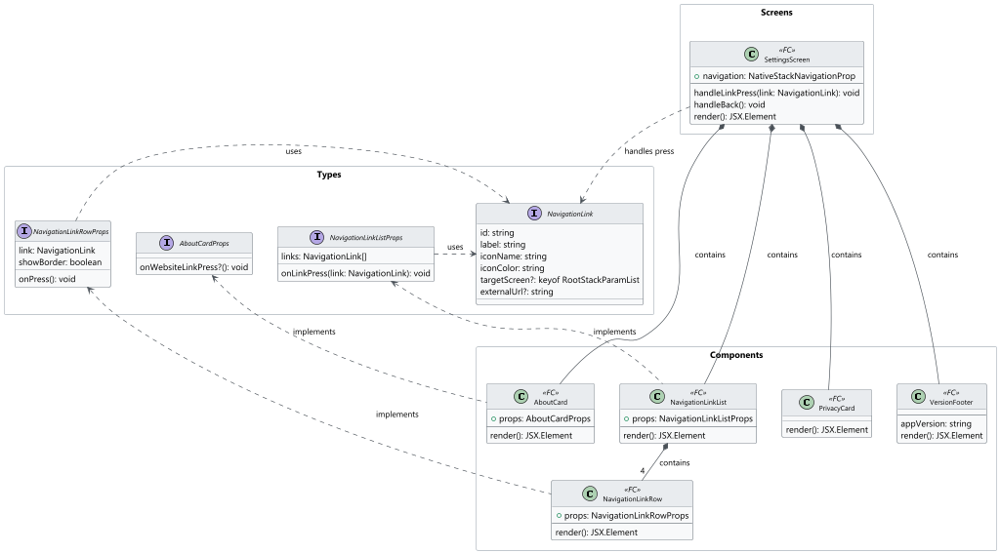
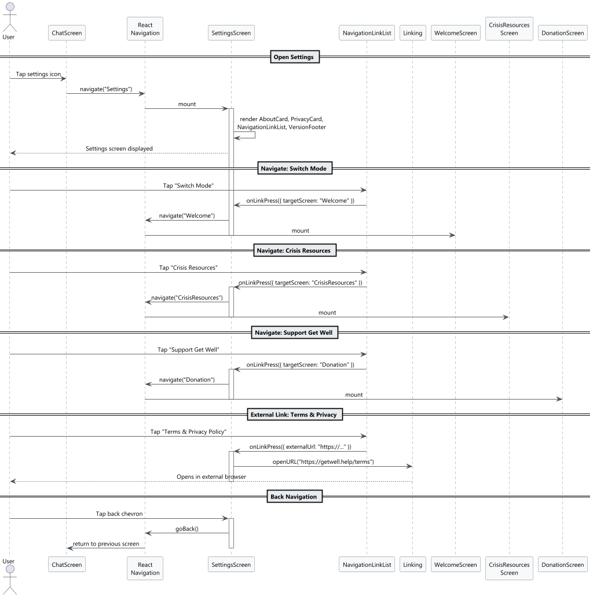
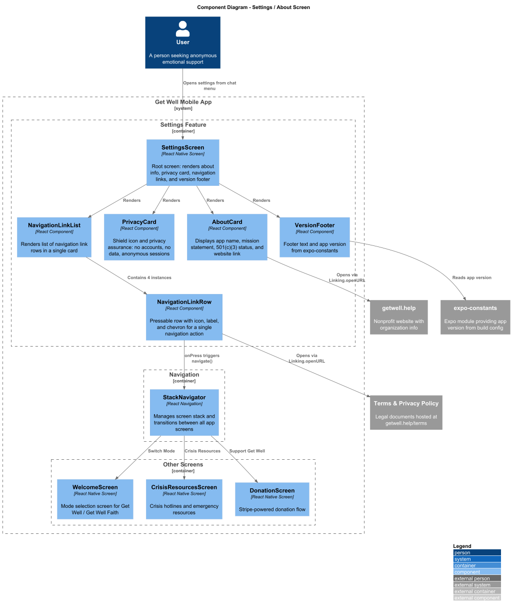

# Detailed Design: Settings / About Screen

## 1. Overview

### 1.1 Purpose

The Settings / About Screen serves as the app's information hub and navigation center. It communicates the Get Well mission, reinforces privacy transparency, and provides quick access to key app features such as mode switching, crisis resources, donations, and legal policies.

### 1.2 Requirements Traceability

| Requirement | Description |
|-------------|-------------|
| L1-6 | Settings and about screen with mission info, privacy assurance, app configuration |
| L2-6.1 | Mission statement, 501(c)(3) status, contact info (getwell.help) |
| L2-6.2 | No personal data collected/stored, explains anonymous sessions |
| L2-6.3 | Navigation links to crisis resources, donation page, mode switching |

### 1.3 User Flow

1. User taps the settings icon from the chat screen menu.
2. The `SettingsScreen` renders with About info, Privacy card, navigation links, and footer.
3. User can tap any navigation link to transition to the relevant screen or external URL.
4. User taps the back chevron to return to the previous screen.

### 1.4 Feature Scope

- Display mission statement, 501(c)(3) status, and website link.
- Communicate privacy policy: no accounts, no data, anonymous sessions.
- Provide navigation links to Switch Mode, Crisis Resources, Support/Donation, and Terms & Privacy Policy.
- Display version number sourced from app configuration.

---

## 2. Component Architecture



### 2.1 Component Tree

```
SettingsScreen
├── Header (back chevron + "Settings")
├── ScrollView
│   ├── AboutCard
│   │   ├── Title ("Get Well")
│   │   ├── Description (mission + 501(c)(3) status)
│   │   └── WebsiteLink ("getwell.help")
│   ├── PrivacyCard
│   │   ├── HeaderRow (shield icon + "Your Privacy")
│   │   └── PrivacyText
│   ├── NavigationLinkList
│   │   ├── NavigationLinkRow ("Switch Mode")
│   │   ├── NavigationLinkRow ("Crisis Resources")
│   │   ├── NavigationLinkRow ("Support Get Well")
│   │   └── NavigationLinkRow ("Terms & Privacy Policy")
│   └── VersionFooter
│       ├── FooterText ("Made with love...")
│       └── VersionText ("Version 1.0.0")
```

### 2.2 SettingsScreen

The root screen component registered with React Navigation.

| Aspect | Detail |
|--------|--------|
| **File** | `src/screens/SettingsScreen.tsx` |
| **Type** | Functional component (React.FC) |
| **Navigation** | Registered as `"Settings"` in the root `StackNavigator` |
| **State** | Stateless; delegates navigation on link press |
| **Header** | Custom header with back chevron (`chevron-left` icon) and "Settings" title (18px semibold) |
| **Behavior** | Renders all child components inside a `ScrollView`. Handles navigation callbacks for each link row. |

**Props:** Receives `navigation` and `route` from React Navigation (`NativeStackScreenProps<RootStackParamList, 'Settings'>`).

### 2.3 AboutCard

Displays the app name, mission statement with 501(c)(3) status, and website link.

| Aspect | Detail |
|--------|--------|
| **File** | `src/components/settings/AboutCard.tsx` |
| **Props** | `AboutCardProps` (optional `onWebsiteLinkPress`) |
| **Renders** | White card (rounded 16, shadow, padding 20, gap 12). Title "Get Well" (22px semibold), description text (14px, `#6D6C6A`), website link "getwell.help" (14px semibold, `#3D8A5A`). |
| **Behavior** | Tapping the website link calls `Linking.openURL('https://getwell.help')` or invokes `onWebsiteLinkPress` if provided. |

### 2.4 PrivacyCard

Displays the privacy assurance with shield icon and explanatory text.

| Aspect | Detail |
|--------|--------|
| **File** | `src/components/settings/PrivacyCard.tsx` |
| **Props** | None |
| **Renders** | White card (rounded 16, shadow, padding 20, gap 8). Header row with `shield` icon (`#3D8A5A`) + "Your Privacy" (16px semibold). Body text explaining anonymous sessions (14px, `#6D6C6A`). |

### 2.5 NavigationLinkList

Container that renders all navigation link rows inside a single white card.

| Aspect | Detail |
|--------|--------|
| **File** | `src/components/settings/NavigationLinkList.tsx` |
| **Props** | `NavigationLinkListProps` (`links: NavigationLink[]`, `onLinkPress: (link: NavigationLink) => void`) |
| **Renders** | White card (rounded 16, shadow). Vertical list of `NavigationLinkRow` components. All rows except the last have a bottom border (`#E5E4E1`). |

### 2.6 NavigationLinkRow

A single pressable row within the navigation link list.

| Aspect | Detail |
|--------|--------|
| **File** | `src/components/settings/NavigationLinkRow.tsx` |
| **Props** | `NavigationLinkRowProps` (`link: NavigationLink`, `onPress: () => void`, `showBorder: boolean`) |
| **Renders** | Row with padding (16 vertical, 20 horizontal), gap 12, vertically centered items. Left icon (size 20, color from link config), label text (15px medium, `#1A1918`), spacer, chevron-right icon (`#9C9B99`). Conditional bottom border. |
| **Accessibility** | `accessibilityRole="button"`, `accessibilityLabel` set to link label. |

### 2.7 VersionFooter

Displays the inspirational footer text and app version number.

| Aspect | Detail |
|--------|--------|
| **File** | `src/components/settings/VersionFooter.tsx` |
| **Props** | None |
| **Renders** | "Made with love for those who need it most." (13px, `#9C9B99`, centered). "Version 1.0.0" (11px, `#9C9B99`, centered). |
| **Version Source** | Version string is read from `expo-constants` (`Constants.expoConfig?.version`) with fallback to `app.json` version field. |

---

## 3. Interfaces and Types

### 3.1 NavigationLink

```typescript
interface NavigationLink {
  id: string;
  label: string;
  iconName: string;       // Lucide icon name (e.g., 'heart', 'triangle-alert')
  iconColor: string;      // Icon foreground color
  targetScreen?: keyof RootStackParamList;  // Internal screen target
  externalUrl?: string;   // External URL (mutually exclusive with targetScreen)
}
```

### 3.2 SettingsScreenProps

```typescript
type SettingsScreenProps = NativeStackScreenProps<RootStackParamList, 'Settings'>;
```

### 3.3 AboutCardProps

```typescript
interface AboutCardProps {
  onWebsiteLinkPress?: () => void;
}
```

### 3.4 NavigationLinkListProps

```typescript
interface NavigationLinkListProps {
  links: NavigationLink[];
  onLinkPress: (link: NavigationLink) => void;
}
```

### 3.5 NavigationLinkRowProps

```typescript
interface NavigationLinkRowProps {
  link: NavigationLink;
  onPress: () => void;
  showBorder: boolean;
}
```

### 3.6 SETTINGS_LINKS Configuration

Static configuration array used to populate the navigation link list.

```typescript
const SETTINGS_LINKS: NavigationLink[] = [
  {
    id: 'switch-mode',
    label: 'Switch Mode',
    iconName: 'heart',
    iconColor: '#3D8A5A',
    targetScreen: 'Welcome',
  },
  {
    id: 'crisis-resources',
    label: 'Crisis Resources',
    iconName: 'triangle-alert',
    iconColor: '#D08068',
    targetScreen: 'CrisisResources',
  },
  {
    id: 'support',
    label: 'Support Get Well',
    iconName: 'gift',
    iconColor: '#3D8A5A',
    targetScreen: 'Donation',
  },
  {
    id: 'terms-privacy',
    label: 'Terms & Privacy Policy',
    iconName: 'info',
    iconColor: '#6D6C6A',
    externalUrl: 'https://getwell.help/terms',
  },
];
```

### 3.7 RootStackParamList (shared)

Defined in `src/types/navigation.ts`, shared across the app:

```typescript
type RootStackParamList = {
  Welcome: undefined;
  Chat: { mode: AppMode };
  CrisisResources: undefined;
  Donation: undefined;
  Settings: undefined;
};
```

---

## 4. Styling and Design Tokens

### 4.1 Screen Layout

| Token | Value |
|-------|-------|
| Screen background | `#F5F4F1` |
| Content padding (horizontal) | 24 |
| Content gap (vertical) | 20 |
| Header height | 56 |

### 4.2 Typography (Outfit Font Family)

| Element | Size | Weight | Color |
|---------|------|--------|-------|
| Header title ("Settings") | 18px | SemiBold (600) | `#1A1918` |
| About title ("Get Well") | 22px | SemiBold (600) | `#1A1918` |
| About description | 14px | Regular (400) | `#6D6C6A` |
| Website link ("getwell.help") | 14px | SemiBold (600) | `#3D8A5A` |
| Privacy header ("Your Privacy") | 16px | SemiBold (600) | `#1A1918` |
| Privacy body text | 14px | Regular (400) | `#6D6C6A` |
| Link row label | 15px | Medium (500) | `#1A1918` |
| Footer text | 13px | Regular (400) | `#9C9B99` |
| Version text | 11px | Regular (400) | `#9C9B99` |

### 4.3 Colors

| Name | Hex | Usage |
|------|-----|-------|
| Background | `#F5F4F1` | Screen background |
| Text Primary | `#1A1918` | Titles, labels, link row labels |
| Text Secondary | `#6D6C6A` | Description text, privacy body, info icon |
| Text Muted | `#9C9B99` | Footer, version, chevron-right icons |
| Green Accent | `#3D8A5A` | Website link, shield icon, heart icon, gift icon |
| Alert Accent | `#D08068` | Crisis resources triangle-alert icon |
| Card Background | `#FFFFFF` | All card backgrounds |
| Border | `#E5E4E1` | Navigation link row dividers |

### 4.4 Component Dimensions

| Element | Dimension |
|---------|-----------|
| Card border radius | 16 |
| Card shadow | elevation 2, shadowColor `#000`, shadowOpacity 0.08, shadowRadius 8, shadowOffset { width: 0, height: 2 } |
| About card padding | 20 |
| About card gap | 12 |
| Privacy card padding | 20 |
| Privacy card gap | 8 |
| Nav link row padding | 16 (vertical), 20 (horizontal) |
| Nav link row gap | 12 |
| Icon size (nav links) | 20 |
| Shield icon size | 20 |
| Chevron-right size | 16 |
| Back chevron size | 24 |

---

## 5. Navigation



### 5.1 Entry Point

The `SettingsScreen` is accessed from the chat screen via a settings/menu icon. It is registered as `"Settings"` in the root `StackNavigator`:

```typescript
<Stack.Screen
  name="Settings"
  component={SettingsScreen}
  options={{ headerShown: false }}
/>
```

### 5.2 Navigation Link Behavior

Each navigation link row triggers a different action when tapped:

| Link | Action | Target |
|------|--------|--------|
| Switch Mode | `navigation.navigate('Welcome')` | `WelcomeScreen` -- returns user to mode selection |
| Crisis Resources | `navigation.navigate('CrisisResources')` | `CrisisResourcesScreen` -- displays crisis hotlines and resources |
| Support Get Well | `navigation.navigate('Donation')` | `DonationScreen` -- Stripe-powered donation flow |
| Terms & Privacy Policy | `Linking.openURL('https://getwell.help/terms')` | External browser / in-app WebView |

### 5.3 External Link Handling

The `getwell.help` website link and Terms & Privacy Policy link open external URLs. The implementation uses React Native's `Linking.openURL()`:

```typescript
const handleLinkPress = (link: NavigationLink) => {
  if (link.externalUrl) {
    Linking.openURL(link.externalUrl);
  } else if (link.targetScreen) {
    navigation.navigate(link.targetScreen);
  }
};
```

For Terms & Privacy Policy, an alternative approach is to use an in-app `WebView` screen if the team prefers keeping users within the app.

### 5.4 Back Navigation

The header back chevron calls `navigation.goBack()` to return to the previous screen (typically the chat screen).

---

## 6. App Version

The version number displayed in the footer is sourced dynamically:

```typescript
import Constants from 'expo-constants';

const appVersion = Constants.expoConfig?.version ?? '1.0.0';
```

This reads the `version` field from `app.json` / `app.config.ts` via `expo-constants`, ensuring the displayed version always matches the build configuration. The fallback `'1.0.0'` is used only if the config is unavailable.

---

## 7. System Context



The `SettingsScreen` is primarily a presentational and navigational feature. It has no backend API dependencies -- all content is static. Its system interactions are:

- **React Navigation** -- for screen transitions to Welcome, CrisisResources, and Donation screens.
- **React Native Linking** -- for opening external URLs (getwell.help website, Terms & Privacy Policy).
- **expo-constants** -- for reading the app version from build configuration.

---

## 8. Accessibility

| Concern | Implementation |
|---------|---------------|
| Screen reader | Header title and all card content use semantic text elements. Navigation rows have `accessibilityRole="button"` with descriptive labels. |
| Touch targets | Navigation link rows span full width with minimum 48dp height. Back chevron has a 48x48 touchable area. |
| Color contrast | All text colors meet WCAG AA contrast ratio against `#FFFFFF` card backgrounds and `#F5F4F1` screen background. |
| Font scaling | Typography uses relative sizing via React Native's `allowFontScaling`. |
| External links | Website and Terms links announce as links (`accessibilityRole="link"`) with hint text indicating they open externally. |

---

## 9. Testing Strategy

| Layer | Scope |
|-------|-------|
| Unit | `AboutCard` renders title, description, and website link. Website link press triggers `Linking.openURL`. |
| Unit | `PrivacyCard` renders shield icon, header, and privacy text. |
| Unit | `NavigationLinkRow` renders icon, label, and chevron. Press invokes `onPress`. Border renders conditionally. |
| Unit | `NavigationLinkList` renders correct number of rows with correct border configuration (last row has no border). |
| Unit | `VersionFooter` renders footer text and version string from `expo-constants`. |
| Integration | `SettingsScreen` renders all child components. Tapping each nav link triggers the correct navigation call or `Linking.openURL`. Back chevron calls `navigation.goBack()`. |
| Snapshot | `SettingsScreen` snapshot matches expected layout. |
| E2E | Navigate to Settings from chat. Verify all content displays. Tap "Switch Mode" and verify navigation to Welcome. Tap "Crisis Resources" and verify navigation. Tap "Support Get Well" and verify navigation to Donation. |

---

## 10. File Manifest

```
src/
├── screens/
│   └── SettingsScreen.tsx
├── components/
│   └── settings/
│       ├── AboutCard.tsx
│       ├── PrivacyCard.tsx
│       ├── NavigationLinkList.tsx
│       ├── NavigationLinkRow.tsx
│       └── VersionFooter.tsx
├── types/
│   └── navigation.ts            # RootStackParamList (shared)
└── constants/
    └── settingsLinks.ts          # SETTINGS_LINKS array, NavigationLink type
```

---

## Diagrams

### Class Diagram


### Sequence Diagram


### C4 Component Diagram


